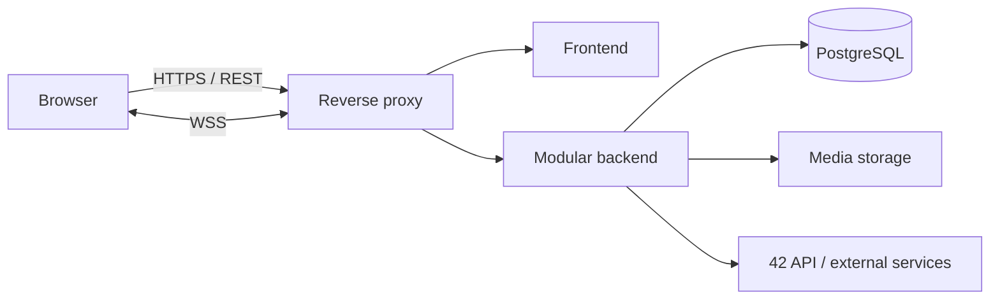

# 42 Horizon - Getting Started Guide and Shared Project Reference

> Documentation version dated September 16, 2026. The project is currently in the
> design / pre-alpha stage. This document explains the vision, the actual state of the
> project, the subject requirements, and a step-by-step method for a five-person team.
> A proposal is not a decision until the team has reviewed, approved, and recorded it.

French version: [DOCUMENTATION.md](DOCUMENTATION.md).

## 1. Purpose of this document

This documentation should enable all five members to:

- describe the same project using the same concepts;
- distinguish between decisions, prototypes, implemented features, and open questions;
- know where to begin without creating five competing architectures;
- understand the dependencies between product, design, backend, frontend, and deployment;
- work on different areas without losing the overall vision;
- prepare for the evaluation, during which everyone must be able to explain the project.

This document is the team's main entry point. It does not replace:

- [PROJECT_CONTEXT.md](PROJECT_CONTEXT.md), which contains the current summary and
  recent decisions;
- [BOARDING_JOURNAL.md](BOARDING_JOURNAL.md), which records how the idea evolved;
- [VERSIONING.md](VERSIONING.md), which defines the Git and release workflow;
- [README.md](README.md), which must eventually describe the actual delivered product
  in English;
- [en.subject.pdf](en.subject.pdf), which remains the official evaluation source.

### Status legend

| Status | Meaning |
| --- | --- |
| **Decided** | An explicit product decision that must be preserved. |
| **Prototyped** | Demonstrated in Figma or a web prototype, but not integrated into the application. |
| **Implemented** | Present in the production application and appropriately verified. |
| **Proposed** | A recommended discussion baseline that the team still needs to validate. |
| **To define** | A functional or technical decision that remains open. |

## 2. Project overview

### 2.1 Vision

**42 Horizon** is the working name of a community platform designed to show what 42
students accomplish before, during, and after their studies. It should highlight people,
projects, progress, and network news for the community, the general public, and recruiters.

The initial problem is simple: it is difficult to quickly discover remarkable paths
within the 42 network, projects produced across its campuses, and the journey followed
by each student. A gallery containing only final success stories is not enough; the
platform should also show progress, experiments, and context.

The **42 Awards** are a possible module within this broader platform, not its sole purpose.

### 2.2 Value proposition

- Visitors can discover the 42 network, its campuses, students, and projects.
- Recruiters can find profiles and understand skills demonstrated through real work.
- Students can build a portfolio, control information visibility, publish projects, and
  participate in the community.
- Editorial contributors can document journeys and news through a community trust and
  verification model.
- Staff and administrators can moderate content, process reports, and maintain data quality.

### 2.3 Decided product principles

- The interface supports French, English, and Arabic; Arabic uses an RTL interface.
- Light is the default theme, with a dark theme available.
- The globe acts as both navigation and filter: **World -> Country -> Campus**.
- Displayed content depends on the selected geographic scope.
- Visitors, authenticated students, staff, and administrators need adapted experiences.
- Profile information, projects, and journey items may be public or private, with
  granularity still to be defined.
- Community posts about a student do not require that student's prior approval for every
  publication. Community verification and content visibility are separate concerns.
- Contributors may edit their own editorial posts. They may not edit unrelated profile
  information without permission.
- The entry screen remains minimal: encrypted message, sign-in/visitor access, language,
  and theme. No brand or introductory tagline appears at that stage.

### 2.4 Decided identity and entry sequence

After a successful sign-in, the selected animation is the **number 20 vertical return
scanner**: binary becomes hexadecimal, then encrypted characters, followed by the
progressive reveal of `BEYOND THE CODE`. A visitor does not see the decryption and moves
directly to the shared sequence: 42 logo, circle, globe, and home screen.

Exact current status:

- animation number 20 exists and has been verified as a standalone web example;
- it has not been integrated into the main user journey;
- sign-in in the prototypes is simulated;
- real authentication, the final globe, the complete home screen, and IP detection have
  not been implemented;
- Figma remains at iteration V9 for the entry screen.

Useful resources:

- [main decryption prototype](work/visualizations/horizon-decryption.html);
- [selected number 20 animation](work/visualizations/decryption-examples/scanner-return.html);
- [globe prototype](work/visualizations/horizon-globe.html);
- [decryption verification notes](work/visualizations/decryption-notes.md);
- [immersive Figma track](work/figma/piste-immersive.md).

## 3. Actual starting state

### 3.1 What exists

- the product vision and its history;
- a Figma library and interface screens;
- shared color, typography, and spacing variables;
- HTML/CSS/JavaScript prototypes for the globe and introduction;
- twenty animation explorations preserved as a research archive;
- eight tests for the decryption engine;
- a Git workflow guide and a README structure based on the subject.

### 3.2 What does not exist yet

- no production frontend application;
- no backend or API contract;
- no database or migration;
- no real authentication;
- no enforced role-based authorization;
- no 42 API integration;
- no IP-based region detection;
- no configured CI pipeline;
- no finalized deployment infrastructure;
- no module selection formally approved by all five members.

The prototypes express design and motion intent. They must not be presented as completed
application features.

## 4. Non-negotiable subject v21.2 requirements

The team is free to choose its product, but it must satisfy the complete mandatory core:

| Requirement | Consequence for 42 Horizon |
| --- | --- |
| Web application | A real frontend, backend, and database are required. |
| Team of 4-5 | All five members must contribute to the mandatory part and modules. |
| Git | Contributions from everyone, clear commits, and credible work distribution. |
| Containerization | The complete application must start with one command. |
| Stable Chrome | Every demonstrated journey must work on its latest stable version. |
| Clean console | No JavaScript warning or error during the demonstration. |
| Multi-user support | Concurrent users without data corruption or critical race conditions. |
| Responsive and accessible | The interface must work across all supported form factors. |
| CSS solution | A structured styling solution must be used. |
| Secrets | `.env` ignored by Git and a documented `.env.example` without real secrets. |
| Data schema | Explicit relationships, reproducible migrations, and useful constraints. |
| Minimum authentication | Secure email/password sign-up and sign-in. |
| Validation | Every form and input validated by both frontend and backend. |
| HTTPS | Every external connection to the backend must be encrypted. |
| Legal pages | Real, accessible Privacy Policy and Terms of Service pages. |
| Modules | At least 14 fully functional, demonstrable module points. |
| README | Complete English documentation containing every required subject section. |

The module minimum does not replace the mandatory core. The 14 points are required in
addition to it.

## 5. Recommended functional scope

The complete product vision is too broad to implement in a single pass. The team should
first validate one vertical release that works from interface to database.

### 5.1 Target Vanilla release - proposal to validate

The first release should allow users to:

1. sign up, sign in, and sign out;
2. view or edit a profile according to their permissions;
3. publish a project with images, description, links, and visibility settings;
4. browse and search profiles/projects by world, country, or campus;
5. comment on and favorite a project;
6. add or remove a friend and see their online status;
7. exchange private real-time messages;
8. report content and process the report with a moderation role;
9. use the entire interface in French, English, and Arabic/RTL;
10. start the complete HTTPS application with one container command;
11. access project-specific Terms of Service and Privacy Policy pages.

This scope already demonstrates the main value: **discovering, showcasing, and connecting
the people and projects of the 42 network**.

### 5.2 Outside the first critical journey

The following capabilities remain relevant, but should wait until the foundation is
stable or require an explicit scope decision:

- complete 42 Awards cycles, categories, submissions, and voting;
- advanced editorial publishing and Wikipedia-like revision history;
- automatic and exhaustive retrieval of 42 Intra data;
- automated recommendations;
- online execution of student projects;
- bonuses, cash prizes, and external rewards;
- advanced analytics dashboards;
- a native mobile application.

“Outside the first journey” does not mean abandoned. This boundary prevents the project
from becoming a large collection of unfinished features.

## 6. Actors, permissions, and visibility

### 6.1 Initial functional roles

| Actor | Minimum expected capabilities |
| --- | --- |
| Anonymous visitor | Explore public content, use the globe and search, open legal pages. |
| Authenticated user | Manage their account, profile, projects, favorites, friends, and messages. |
| Editorial contributor | Create and edit their own editorial posts under defined rules. |
| Moderator / staff | Review reports, hide or restore content, and justify decisions. |
| Administrator | Manage roles, reference data, global rules, and accounts with an audit trail. |

In the initial notes, “visitor” can also mean an external account. The team must decide
whether comments, tickets, or private messages require authentication. The recommended
secure default is to require an account for every write action.

### 6.2 Three different controls

Do not confuse:

1. **Authentication**: who is this user?
2. **Authorization**: which action may their role and relationship to the resource perform?
3. **Visibility**: who may read this information?

A private resource does not become secure because its UI button is hidden. The backend
must filter every read and mutation.

### 6.3 Proposed visibility model

Start with only:

- `PUBLIC`: readable without authentication;
- `MEMBERS`: readable by authenticated users;
- `PRIVATE`: readable by the owner and explicitly authorized roles.

Add a `FRIENDS` scope only after defining and testing its behavior in lists, search,
media access, and caching.

## 7. Reference user journeys

### 7.1 Visitor

1. Opens the entry page.
2. Selects a language and theme when needed.
3. Selects “Visitor”; the slogan is not decrypted.
4. Sees the logo, circle, globe, and then the home screen.
5. Explores World -> Country -> Campus.
6. Views only public profiles, projects, and news.
7. Uses search and may create an account to interact.

### 7.2 Sign-in

1. The user opens the sign-in panel from the entry page.
2. They enter an email and password.
3. Frontend and backend both validate the input.
4. A failed attempt produces a useful error without confirming whether an email exists.
5. A successful attempt plays scanner number 20 and reveals `BEYOND THE CODE`.
6. The shared sequence leads to the personalized home screen.
7. The session survives a reload according to the selected security strategy.

### 7.3 Publishing a project

1. A student creates a draft.
2. They add a title, summary, description, technologies, and links.
3. They upload media validated for type and size on both client and server.
4. They select the visibility level.
5. They preview and publish.
6. The backend records the author, dates, and any useful audit event.
7. The project appears only within authorized scopes and searches.

### 7.4 Community interaction

1. An authenticated user comments on or favorites a project.
2. The backend checks the account, resource, visibility, and permission.
3. The operation is atomic and resists duplicate submission.
4. Relevant clients receive the real-time update when appropriate.
5. A comment may be reported, and moderation produces an audit trail.

### 7.5 Moderation

1. A moderator opens the report queue.
2. They inspect the content, reason, and authorized context.
3. They dismiss the report, hide the content, or restore it with a reason.
4. The author receives appropriate information.
5. The decision is recorded in an audit log the author cannot edit.

## 8. Technical architecture - proposal for team review

### 8.1 Recommended principle

Begin with a **modular monolith** in a monorepo, not microservices. Keep domains separate
in code while using one backend application and one database. This simplifies
transactions, migrations, tests, and deployment. Extract a separate service only after
measuring a real need.

### 8.2 Proposed reference stack

| Layer | Proposal | Why it fits the project |
| --- | --- | --- |
| Language | TypeScript | Shared language and types across frontend and backend. |
| Frontend | React + Vite | Mature ecosystem for components, i18n, and interactive visualization. |
| Routing / server data | React Router + TanStack Query | Explicit routes, server cache, and controlled loading states. |
| Styling | CSS Modules or Tailwind with CSS tokens | Responsive themes and RTL without uncontrolled global styles. |
| Backend | NestJS with a team-selected adapter | Structured modules, injection, validation, and WebSockets. |
| API | Versioned REST + OpenAPI | Readable, testable, and documented contracts. |
| Real time | WebSocket / Socket.IO | Presence, messaging, and multi-client notifications. |
| Database | PostgreSQL | Relationships, constraints, transactions, and structured search. |
| ORM | Prisma | Readable schema, migrations, and TypeScript types. |
| Files | S3-compatible object storage | Separates media from the database and supports access control. |
| Reverse proxy | Caddy or Nginx | HTTPS termination and service routing. |
| Runtime | Docker Compose | Reproducible startup with one command. |
| Tests | Vitest, Testing Library, Supertest, Playwright | Unit, API integration, and browser journey coverage. |

This stack is **not decided yet**. Before generating the application, all five members
must compare their skills, verify supported versions, and record short ADRs for the
structural choices. A different stack is valid if it satisfies the constraints and can
be understood by the entire team.

### 8.3 Main data flow



The browser never connects directly to the database. External calls that require a
secret originate from the backend. Internal communication may remain unencrypted inside
the private container network, as permitted by the subject.

### 8.4 Recommended backend modules

- `auth`: registration, sign-in, session, renewal, and sign-out;
- `users`: account identity and preferences;
- `profiles`: public/private presentation, campus, and journey;
- `projects`: drafts, publication, technologies, and visibility;
- `media`: validation, storage, preview, and deletion;
- `geography`: countries, campuses, and globe scope;
- `search`: filters, sorting, and pagination;
- `social`: friends, favorites, and comments;
- `chat`: conversations, messages, and presence;
- `moderation`: reports, decisions, and audit trail;
- `content`: editorial posts;
- `awards`: reserved for a later phase;
- `legal`: accepted legal-text versions if the team selects this traceability.

Each module should own an API/controller, business service, validation, authorization
policy, data access, and tests. Modules should communicate through defined domain
interfaces instead of reading each other's tables arbitrarily.

### 8.5 Recommended frontend organization

- `app`: configuration, providers, router, and global error handling;
- `pages`: route composition without deep business logic;
- `features`: authentication, project, search, globe, chat, and moderation;
- `entities`: UI models and entity-oriented components;
- `shared/ui`: design-system components;
- `shared/api`: typed HTTP client and error handling;
- `shared/i18n`: dictionaries, formats, direction, and language switching;
- `shared/lib`: genuinely shared utilities;
- `styles`: tokens, themes, fonts, and minimal global rules.

Frontend permission logic improves the experience, but the backend remains the source
of truth.

## 9. Initial data model

The final schema must be designed collectively before migrations are written. The model
below is a discussion baseline, not an executable migration.

### 9.1 First-release entities

| Entity | Purpose | Main relationships |
| --- | --- | --- |
| `User` | Account, email, password hash, status | 1-1 Profile, N-N Role |
| `Profile` | Display name, bio, avatar, campus | N-1 Campus, 1-N Project |
| `Role` / `UserRole` | Role-based access control | N-N User |
| `Campus` | 42 campus and geographic data | N-1 Country, 1-N Profile |
| `Country` | Geographic filter grouping | 1-N Campus |
| `Project` | Portfolio item, state, visibility | N-1 author, 1-N media/comment |
| `Media` | File metadata | N-1 Project or Profile |
| `Technology` / `ProjectTechnology` | Technical tags | N-N Project |
| `Comment` | Discussion under a project | N-1 author, N-1 Project |
| `Favorite` | Saved project | N-1 User, N-1 Project, unique pair |
| `Friendship` | Invitation and relationship | two users, state, normalized uniqueness |
| `Conversation` / `Participant` | Authorized chat group | N-N User |
| `Message` | Persistent message | N-1 Conversation, N-1 author |
| `Report` | Content report | author and polymorphic target or dedicated tables |
| `ModerationAction` | Traceable decision | N-1 Report, N-1 moderator |
| `AuditEvent` | Sensitive action record | actor, type, resource, date, safe metadata |

### 9.2 Possible later entities

- `EditorialPost` and revision history;
- `AwardCycle`, `AwardCategory`, `Submission`, `Vote`, and `Result`;
- `Ticket` and administration exchanges;
- `Notification` and delivery preferences;
- `Imported42Identity` to separate imported and user-edited data.

### 9.3 Data rules to define before implementation

- logical or physical deletion for each resource;
- email uniqueness and email-change workflow;
- media ownership and orphan cleanup;
- inherited or item-specific visibility;
- retention of messages and moderated content;
- source and freshness of imported data;
- behavior when a campus or account is disabled;
- voting rules if Awards enter the release scope.

## 10. API and real-time contracts

### 10.1 Proposed REST conventions

- `/api/v1` prefix;
- plural resource names;
- cursor-based or page-based pagination, with one convention per collection;
- structured errors containing a stable code, translatable message, and field details;
- ISO 8601 UTC dates;
- opaque identifiers;
- OpenAPI generated and verified in CI;
- passwords, tokens, and secrets never written to logs.

Example route families:

```text
POST   /api/v1/auth/register
POST   /api/v1/auth/login
POST   /api/v1/auth/logout
GET    /api/v1/me
PATCH  /api/v1/me/profile
GET    /api/v1/projects
POST   /api/v1/projects
GET    /api/v1/projects/:projectId
PATCH  /api/v1/projects/:projectId
POST   /api/v1/projects/:projectId/comments
POST   /api/v1/projects/:projectId/favorite
GET    /api/v1/campuses
GET    /api/v1/search
POST   /api/v1/reports
GET    /api/v1/moderation/reports
```

These names illustrate a possible contract. They become official only after team review
and contract testing.

### 10.2 Proposed real-time events

- `presence.changed`;
- `message.created`;
- `message.read` if read receipts are selected;
- `comment.created`;
- `friendship.updated`;
- `notification.created`.

Every event needs a version, authorized emitter, recipients, payload, reconnection
strategy, expected ordering, and duplication behavior. A client must be able to
resynchronize through REST after disconnection; WebSocket messages must not be the only
source of truth.

## 11. Security, privacy, and compliance

### 11.1 Recommended authentication approach

- hash passwords with Argon2id or another recognized, correctly configured algorithm;
- prefer `HttpOnly`, `Secure`, and appropriately configured `SameSite` session cookies
  over storing sensitive tokens in `localStorage`;
- protect sensitive operations against CSRF according to the selected architecture;
- rate-limit sign-in attempts and log anomalies without sensitive data;
- correctly invalidate sessions on sign-out and critical account changes;
- never publicly confirm whether a particular email address is registered.

### 11.2 Input and file validation

- define validation schemas with shared intent, while always revalidating on the backend;
- inspect actual MIME type, extension, size, and media dimensions;
- generate storage names on the server;
- prevent uploaded files from being executed;
- verify ownership before private reads, replacement, or deletion;
- escape or sanitize rich content before rendering it.

### 11.3 Authorization

- apply an explicit policy for every action and resource;
- test horizontal access: user A cannot edit user B's resource;
- test vertical access: a member cannot call an administrator route;
- audit moderation and administration actions;
- deny access by default when a rule is missing or ambiguous.

### 11.4 Privacy

The Privacy Policy must describe the actual data collected, its purpose, retention,
recipients, user rights, and a contact. The Terms of Service must cover accounts,
published content, prohibited behavior, moderation, and liability. These pages cannot be
empty or placeholder content.

The planned IP-based regional brand rule needs a data-minimization decision. Ideally,
the application should derive a temporary region without retaining the raw address.
This behavior has not been implemented.

## 12. Internationalization, RTL, and accessibility

### 12.1 Internationalization rules

- no user-facing text hard-coded inside components;
- complete FR, EN, and AR dictionaries using matching keys;
- locale-aware number, date, and plural formatting;
- update the document's `lang` and `dir` attributes;
- keep `BEYOND THE CODE` in English across all three interfaces;
- do not automatically translate user content without a product decision.

### 12.2 RTL rules

- use logical CSS properties such as `margin-inline` and `inset-inline-start`;
- mirror the interface composition, not geographic maps;
- preserve the internal brand order: 42 symbol, then name;
- test forms, directional icons, panels, navigation, and animations;
- never infer the interface language from the campus being viewed.

### 12.3 Minimum quality accessibility practices

- full keyboard navigation;
- visible focus and logical focus order;
- semantic headings and landmarks;
- real labels and field-associated errors;
- verified contrast in both themes;
- motion alternatives and `prefers-reduced-motion` support;
- useful alternative text for media;
- a list/search alternative to the interactive globe;
- appropriate announcements for important real-time updates.

The WCAG 2.1 AA major module should be claimed only after complete compliance has been
audited. These practices remain necessary even if the module is not claimed.

## 13. Subject modules - recommended package for discussion

### 13.1 Proposal aligned with 42 Horizon

| Module | Type | Points | Product value | Completion condition |
| --- | --- | ---: | --- | --- |
| Frontend + backend frameworks | Major | 2 | Structures the complete application | Both sides genuinely use their frameworks. |
| Real-time features | Major | 2 | Chat, presence, and live updates | Graceful connection/disconnection and efficient broadcasting. |
| User interaction | Major | 2 | Chat, profiles, and friends | All three required areas are complete. |
| Standard user management | Major | 2 | Profile, avatar, friends, online state | Every listed module requirement is demonstrated. |
| Advanced permissions | Major | 2 | Staff/admin and moderation | User CRUD, roles, and role-dependent views/actions. |
| ORM | Minor | 1 | Schema and migrations | Used for real application data access. |
| Custom design system | Minor | 1 | 42 Horizon identity | Palette, typography, icons, and at least 10 reusable components. |
| Advanced search | Minor | 1 | Profile/project discovery | Filters, sorting, and pagination. |
| File management | Minor | 1 | Avatars and project media | Validation, access control, preview, progress, and deletion. |
| Three languages | Minor | 1 | French, English, Arabic | Complete translations and translatable user-facing text. |
| RTL support | Minor | 1 | Arabic experience | Complete mirroring and RTL-specific adjustments. |
| **Proposed total** |  | **16** | Two-point safety margin | An incomplete module earns zero. |

This selection gives the team a margin above 14 points, but it is still a large workload.
Before approval, create a sheet for every module containing its expected demonstration,
exact requirements, primary owner, reviewer, dependencies, and estimate.

### 13.2 Advanced globe option

The “advanced 3D graphics” major module could fit the globe, but a decorative globe is
not enough. It would need a genuinely advanced 3D environment, identifiable rendering
techniques, fluid interaction, and performance measurements. Do not count this module
until that scope is explicitly accepted and demonstrable.

### 13.3 Modules not to select automatically

- microservices: high operational cost without an established need;
- AI: no AI feature is necessary for the current core value;
- blockchain: the Awards do not automatically justify blockchain;
- game modules: outside the current concept and dependent on many prerequisites.

## 14. Five-person team organization

### 14.1 Roles already identified

| Member | Coordination role | Ongoing responsibility |
| --- | --- | --- |
| Rachid EL HASSANI (`rel-hass`) | Product Owner | Vision, backlog, priorities, functional validation. |
| Mohammed Abrar SHARIAR (`mshariar`) | Project Manager / Scrum Master | Planning, meetings, risks, dependencies, blockers. |
| Hasan CHOWDHURI (`hchowdhu`) | Technical Lead / Architect | Architecture, stack, quality, critical reviews. |
| Magomed MUTSULKHANOV (`mmutsulk`) | Developer | Implementation, tests, documentation, reviews. |
| Medhy KETTAB (`mkettab`) | Developer | Implementation, tests, documentation, reviews. |

These roles do not exempt anyone from development. The subject requires every member to
contribute to both the mandatory part and the modules.

### 14.2 Organize around domains, not permanent silos

Do not assign one person to “frontend forever” and another to “backend forever.” Assign
**vertical features**. A feature owner works across schema, API, interface, tests, and
documentation with support from another member.

| Initial domain | Suggested role-based lead | Partner / reviewer |
| --- | --- | --- |
| Vision, criteria, legal content | PO | PM + one developer |
| Architecture, security, conventions | Tech Lead | rotating developer |
| Authentication and profile | one developer | Tech Lead |
| Projects, media, visibility | one developer | PO + another developer |
| Search, globe, geography | one developer | Figma/design integrator |
| Social, chat, real time | one developer | Tech Lead |
| Moderation and permissions | pair of members | PO |
| Containers, CI, basic observability | Tech Lead + PM | one developer |

Actual names must be assigned when tasks are created. Documentation must never claim a
contribution before the corresponding work exists.

### 14.3 Mandatory knowledge sharing

- every PR has a reviewer from another area;
- each week, one member gives a ten-minute walkthrough of a component they built;
- structural decisions receive a short ADR;
- at least two members can diagnose each feature;
- before evaluation, everyone runs every journey and explains architecture, security,
  data model, deployment, and modules.

## 15. Step-by-step implementation method

### Step 0 - align product and subject

**Goal:** avoid coding before agreeing on a first release.

Actions:

1. All five members read this document, the subject, and the project context.
2. The PO presents the vision in five minutes without discussing technology.
3. The team validates target users and the vertical Vanilla journey.
4. It resolves the blocking questions in section 22.
5. It selects the intended modules and a realistic margin above 14 points.
6. The PM turns the scope into epics and then one-to-three-day tasks.
7. Every member restates the project and modules in their own words.

Deliverables: one-page vision, selected-module list, prioritized backlog, role matrix,
and acceptance criteria for the first journey.

### Step 1 - technical choices and feasibility proofs

**Goal:** reduce risk before creating the complete architecture.

Actions:

1. Compare no more than two stack options using the same criteria.
2. Validate session, file-storage, and real-time strategies.
3. Build a small disposable spike: browser -> HTTPS -> backend -> database.
4. Test a WebSocket connection and reconnection.
5. Verify that the selected globe remains smooth on desktop and mobile.
6. Write ADRs for the approved choices.

Deliverables: selected stack, locked versions, architecture diagram, known risks, and
spike results. A spike does not automatically become production code.

### Step 2 - reproducible project bootstrap

**Goal:** provide the same environment to every member.

Actions:

1. Create the monorepo and frontend/backend/shared package workspaces.
2. Add formatting, linting, TypeScript checks, and tests.
3. Create `.env.example` without secrets and ignore `.env`.
4. Create frontend, backend, database, and reverse-proxy containers.
5. Expose the application through HTTPS with documented development certificates.
6. Add a minimal migration and health endpoint.
7. Configure CI to run the same commands used locally.

Exit criterion: a new member can clone the repository, configure the environment, and
start the full stack using one documented command.

### Step 3 - design system and application shell

**Goal:** integrate the visual direction without blocking business features.

Actions:

1. Convert selected Figma tokens into application-consumable variables.
2. Build at least Button, IconButton, Input, Textarea, Select, Dialog, Drawer, Card,
   Avatar, Badge, Tabs, and Toast components.
3. Document variants, states, keyboard behavior, themes, and RTL.
4. Set up routing, layout, navigation, and error pages.
5. Add FR/EN/AR from the first component; do not translate everything at the end.
6. Respect `prefers-reduced-motion` when integrating the entry experience.

Exit criterion: components have examples and useful tests, with no product copy hard-
coded outside translation dictionaries.

### Step 4 - identity, authentication, and permissions

**Goal:** secure the foundation required by every other feature.

Actions:

1. Model User, Profile, Role, and Session.
2. Create migrations and minimal development fixtures.
3. Implement registration, sign-in, sign-out, and session retrieval.
4. Add frontend/backend validation and attempt rate limiting.
5. Implement access policies and negative tests.
6. Connect the entry experience: visitor without decryption, successful sign-in with
   animation number 20.
7. Verify themes, three languages, mobile layout, and reduced motion.

Exit criterion: two users can be connected simultaneously, remain isolated, and cannot
edit one another's data.

### Step 5 - first vertical business journey

**Goal:** publish and discover a project end to end.

Actions:

1. Model Campus, Country, Project, Media, and Technology.
2. Build draft creation, editing, preview, publication, and deletion.
3. Add media storage and access control.
4. Display public/private profiles and projects according to policy.
5. Connect the globe and lists to the same geographic-scope state.
6. Add search, filters, sorting, and pagination.
7. Test concurrency, authorization, and Playwright journeys.

Exit criterion: a student publishes a project with media; a visitor finds it through a
campus; private content is absent from routes, search, and unauthorized media access.

### Step 6 - community and real time

**Goal:** make the platform truly multi-user.

Actions:

1. Add comments and favorites with useful uniqueness constraints.
2. Add friend requests, acceptance, removal, and presence.
3. Add conversations and persistent messages.
4. Handle connection, disconnection, reconnection, and REST synchronization.
5. Test two browsers and simultaneous actions.
6. Add blocking or advanced features only when the corresponding module is selected.

Exit criterion: two accounts communicate in real time, recover history, and cannot
subscribe to a conversation they do not belong to.

### Step 7 - moderation, legal content, and resilience

**Goal:** make the platform manageable and evaluation-ready.

Actions:

1. Implement reporting, a review queue, and audited decisions.
2. Complete roles, user management, and conditional views.
3. Publish legal pages containing real content reviewed by the team.
4. Add global error handling, empty states, and network degradation behavior.
5. Add backup, a tested restore procedure, and minimum incident documentation.

Exit criterion: every sensitive action is protected, explainable, and tested.

### Step 8 - hardening and module validation

**Goal:** demonstrate every claim instead of merely listing it.

Actions:

1. Create a demonstration sheet for every module and every listed requirement.
2. Test security, concurrency, responsive behavior, RTL, keyboard, and browser console.
3. Measure critical journeys and globe performance; fix regressions.
4. Ask someone who did not configure the project to install and test it.
5. Rehearse the complete demonstration from a clean repository.
6. Complete the English README with real versions, stack, modules, and contributions.

Exit criterion: every announced module is fully demonstrable and the validated total is
at least 14 points.

### Step 9 - evaluation preparation

**Goal:** ensure all five members understand the complete product.

Actions:

1. Rehearse a short presentation followed by a demonstration without hidden manual setup.
2. Randomly assign members to explain each technical area.
3. Have everyone explain every table, authentication flow, and real-time event.
4. Simulate a small change requested during evaluation.
5. Verify the submitted commit, variables, one-command startup, and demo accounts.
6. Ensure the README honestly attributes each contribution.

## 16. Concrete first week

### Day 1 - shared workshop

- read and restate the vision;
- validate the first journey and explicitly deferred items;
- make a provisional module selection;
- list technical decisions that require a spike;
- create the **To clarify -> Ready -> In progress -> In review -> Done** board.

### Day 2 - shared design

- context diagram and initial data model;
- role/action/resource matrix;
- API error contract;
- screen inventory for the first journey;
- at most two stack options to compare.

### Day 3 - technical spikes

- HTTPS and container proof;
- backend/database connection;
- minimum secure session;
- WebSocket reconnection;
- globe performance test.

### Day 4 - decision and bootstrap

- fact-based comparison of spike results;
- ADRs and stack decision;
- monorepo, lint, tests, CI, and `.env.example`;
- first migration and health endpoint.

### Day 5 - collective review

- clean installation by another member;
- documentation correction;
- breakdown of the next two sprints;
- owner and reviewer assignment for every task;
- demonstration of what actually works.

Do not start five large features in parallel during this week. The purpose is to create
a shared, verifiable foundation.

## 17. Daily workflow

The complete rules are in [VERSIONING.md](VERSIONING.md). The essentials are:

1. one clear task with acceptance criteria;
2. one short branch from an up-to-date `main`;
3. coherent English commits using `type(scope): description`;
4. one focused PR with test evidence;
5. at least one independent review, or two for sensitive changes;
6. squash task PRs according to the documented convention;
7. no permanent branch per person or application layer;
8. releasing remains separate from merging.

### Recommended minimum meetings

- short synchronization on working days: completed, next, blocked;
- weekly planning led by the PM;
- weekly review/demo led by the contributors;
- short retrospective: keep, stop, try;
- architecture workshop only when a cross-cutting decision requires it.

## 18. Definition of Ready and Definition of Done

### A task is ready when

- its user goal is understood;
- acceptance criteria are observable;
- dependencies and data are known;
- an owner and reviewer are assigned;
- the related subject module is identified;
- relevant errors, permissions, languages, and form factors are mentioned.

### A task is done when

- code has been reviewed and merged;
- lint, types, and tests pass;
- positive and negative authorization cases are tested;
- loading, empty, and error states exist;
- relevant responsive, theme, and RTL behavior has been checked;
- no warning or error appears in the browser console;
- affected contracts, migrations, and documentation are current;
- the demonstration matches the acceptance criteria exactly.

## 19. Test strategy

| Level | Target | Examples |
| --- | --- | --- |
| Unit | Pure business rules | visibility, permissions, calculations, validation |
| Component | Isolated UI | forms, errors, keyboard, RTL variants |
| Integration | Backend + database | transactions, constraints, access policies |
| Contract | APIs and events | REST schemas, error codes, WebSocket payloads |
| End to end | User journeys | registration, publication, search, chat, moderation |
| Concurrency | Multi-user behavior | duplicate favorite, simultaneous messages, concurrent update |
| Security | Access boundaries | IDOR, insufficient role, private media, rate limiting |
| Visual | Critical screens | themes, mobile, Arabic, animation, targeted regressions |

The proposed CI should run formatting/lint, type checking, unit and integration tests,
build, migration verification, and a small smoke test. Full end-to-end tests may use a
separate job if they are slow, but they remain mandatory before a release.

## 20. Deployment and environments

Plan for three logical environments:

- **local**: development with fixtures and containerized services;
- **preview/staging**: PR validation or a production-like demonstration;
- **production/evaluation**: stable, backed-up, documented configuration.

The final command may resemble `docker compose up --build`, but documentation must use
the real command implemented by the repository. The team must verify:

- startup order and health checks;
- controlled automatic migrations or an explicit migration procedure;
- external HTTPS;
- persistent volumes;
- backup and restore;
- no secrets in images, logs, or Git;
- clean stop/restart without data loss or corruption.

## 21. Proposed repository structure

```text
.
|-- apps/
|   |-- web/
|   `-- api/
|-- packages/
|   |-- contracts/
|   |-- design-system/
|   `-- config/
|-- infra/
|   |-- proxy/
|   `-- compose/
|-- docs/
|   |-- adr/
|   |-- architecture/
|   `-- product/
|-- tests/
|   `-- e2e/
|-- work/                 # preserved Figma research and prototypes
|-- .env.example
|-- compose.yaml
|-- DOCUMENTATION.md
|-- DOCUMENTATION.en.md
|-- PROJECT_CONTEXT.md
`-- README.md
```

This structure is a proposal. Do not move the existing archives before the team approves
its structure and verifies every documentation link.

## 22. Decisions to make before the affected work begins

### Blocking the initial implementation

1. What is the exact Vanilla scope?
2. Which modules make up the required 14 points plus safety margin?
3. Which stack and versions can the team confidently maintain?
4. Server-side session or short-lived/renewable tokens, and why?
5. Where are media files stored locally and during evaluation?
6. How are countries, campuses, and imported data represented?
7. Which write actions require an account?

### Blocking only the corresponding domains

- exact visibility per profile field, project, and editorial post;
- complete permission matrix and distinction between staff, moderator, and admin;
- 42 Intra integration: OAuth, synchronization, consent, frequency, and fields;
- final meaning of `أفق` or another Arabic brand form;
- IP detection and handling of that data;
- comment, ticket, and message behavior for external users;
- complete Awards rules and mitigation of biased voting;
- community moderation and revision history;
- entry-animation behavior on later visits.

An open question should not block independent work. Turn it into a decision task with an
owner, due date, and documented consequences.

## 23. Main risks and responses

| Risk | Early signal | Response |
| --- | --- | --- |
| Scope too large | Many screens, no complete journey | Prioritize one vertical slice and defer advanced Awards/editorial work. |
| Incomplete modules | One listed sub-requirement is missing | Use exact checklists and plan module demonstrations early. |
| Knowledge silos | Only one person can fix a domain | Cross-review, internal demos, and rotating pairs. |
| Late permissions | Private data leaks | Policies and negative tests from the first route. |
| Late RTL work | Broken Arabic interface | Use all three languages from the design-system stage. |
| Prototype confused with product | Progress is overstated | Always label prototyped, implemented, and verified states. |
| Globe too expensive | Low mobile FPS | Spike, performance budget, and accessible fallback. |
| Fragile real time | Duplicates after reconnect | IDs, idempotency, and REST resynchronization. |
| Unsafe media | Dangerous or orphaned files | Server validation, isolated storage, tested cleanup. |
| Docker only works for its author | Others cannot install | Weekly clean installation by another member. |

## 24. What every member must be able to explain

By the end, everyone must be able to answer without reading the code:

- Which problem does 42 Horizon solve, and for whom?
- Why are the Awards only one module?
- What is the difference between visitor, member, staff, and administrator?
- How does the globe filter data?
- How does a private project remain private in the API, search, and media storage?
- How does registration work, and where is the session stored?
- How are passwords and secrets protected?
- What happens when two users act simultaneously?
- How does chat reconnect without losing state?
- How are FR/EN/AR and RTL structured?
- How does the application start in one command and use HTTPS?
- Which modules are claimed, and how is every requirement demonstrated?
- What did each member personally implement, and which challenges did they solve?

If one person cannot explain an answer, the team has a knowledge-transfer gap to fix,
not merely an individual problem.

## 25. Member onboarding checklist

- [ ] Read `DOCUMENTATION.en.md`, `PROJECT_CONTEXT.md`, `IDEA.md`, and the subject.
- [ ] Open the prototypes and distinguish archives from the selected direction.
- [ ] Read `VERSIONING.md` before creating a branch or PR.
- [ ] Install the project from a clean copy once the bootstrap exists.
- [ ] Run lint, tests, build, and the containerized stack.
- [ ] Review the database schema and migrations.
- [ ] Play every available visitor, member, staff, and admin journey.
- [ ] Read the permission matrix and one negative test per sensitive resource.
- [ ] Identify the subject modules supported by the assigned task.
- [ ] Select a limited first ticket with an owner and reviewer.
- [ ] Present the modified flow to another member afterward.

## 26. Shared glossary

| Term | Meaning in this project |
| --- | --- |
| 42 Horizon | Working name of the platform. |
| Vanilla | Target containing the complete mandatory core and selected 14 points, as defined in VERSIONING.md. |
| Scope | World, country, or campus selected through the globe. |
| Portfolio | Student information and projects presented through the platform. |
| Editorial post | Community content about a student or the network. |
| Visibility | Rule determining who may read a resource. |
| Permission | Rule determining who may perform an action. |
| Prototype | A design or proof that is not yet part of the delivered application. |
| ADR | Short record of an architecture decision, options, and consequences. |
| Vertical slice | A usable feature from interface to database, including tests. |
| Definition of Done | Shared conditions required before considering a task complete. |

## 27. Next collective action

The next step is not to develop a random page. The five members should run a workshop
and produce, in this order:

1. the accepted Vanilla scope;
2. the module list and point total;
3. the role/permission/visibility matrix;
4. the initial data model;
5. comparative stack spikes;
6. ADRs for technical decisions;
7. the backlog for the first two sprints.

Once these seven items are approved, the team can initialize the production application
and follow steps 2 through 9 of this guide from a shared foundation.
