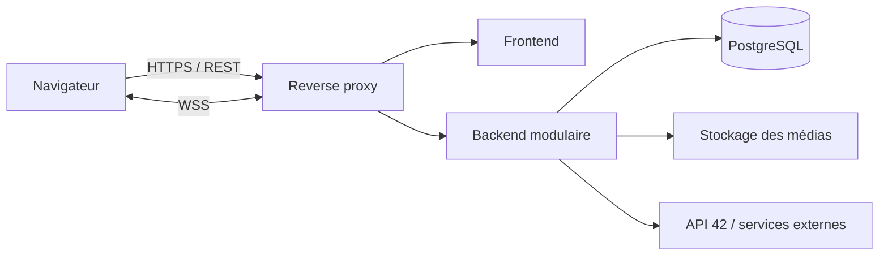

# 42 Horizon - documentation de démarrage et référence commune

> Version documentaire du 16 septembre 2026. Le projet est en conception / pré-alpha.
> Ce document explique la vision, l'état réel, les contraintes du sujet et une méthode
> de réalisation à cinq. Une proposition n'est pas une décision tant que l'équipe ne
> l'a pas validée et consignée.

English version: [DOCUMENTATION.en.md](DOCUMENTATION.en.md).

## 1. Pourquoi ce document existe

Cette documentation doit permettre aux cinq membres de :

- raconter le même projet avec les mêmes mots ;
- distinguer ce qui est décidé, prototypé, développé ou encore ouvert ;
- savoir par où commencer sans créer cinq architectures concurrentes ;
- comprendre les dépendances entre produit, design, backend, frontend et déploiement ;
- travailler sur des zones différentes sans perdre la vision d'ensemble ;
- préparer l'évaluation, pendant laquelle chacun doit pouvoir expliquer le projet.

Ce document est le point d'entrée collectif. Il ne remplace pas :

- [PROJECT_CONTEXT.md](PROJECT_CONTEXT.md), qui conserve l'état synthétique et les
  décisions récentes ;
- [BOARDING_JOURNAL.md](BOARDING_JOURNAL.md), qui raconte l'évolution de l'idée ;
- [VERSIONING.md](VERSIONING.md), qui fixe le workflow Git et les publications ;
- [README.md](README.md), qui devra présenter en anglais ce qui est réellement livré ;
- [en.subject.pdf](en.subject.pdf), qui reste la source officielle pour l'évaluation.

### Légende d'état

| État | Signification |
| --- | --- |
| **Décidé** | Demande explicite retenue pour le produit. |
| **Prototypé** | Démontré dans Figma ou dans un prototype web, mais pas intégré à l'application. |
| **Réalisé** | Présent dans l'application de production et vérifié. |
| **Proposé** | Base de discussion recommandée ; l'équipe doit encore la valider. |
| **À définir** | Choix fonctionnel ou technique encore ouvert. |

## 2. Résumé du projet

### 2.1 Vision

**42 Horizon** est le nom de travail d'une plateforme communautaire destinée à montrer
ce que deviennent les étudiants de 42 avant, pendant et après leur cursus. Elle doit
mettre en valeur les personnes, leurs projets, leur progression et les actualités du
réseau auprès de la communauté, du public et des recruteurs.

Le problème de départ est simple : il est difficile de découvrir rapidement les
parcours remarquables issus de 42, les projets réalisés sur les différents campus et le
chemin suivi par les étudiants. Une galerie limitée aux meilleurs résultats ne suffit
pas ; la plateforme doit aussi montrer l'évolution, les essais et le contexte.

Les **42 Awards** sont un module possible de cette plateforme, pas son unique objet.

### 2.2 Proposition de valeur

- Pour un visiteur : découvrir le réseau 42, ses campus, ses étudiants et ses projets.
- Pour un recruteur : rechercher des profils et comprendre des compétences démontrées
  par des réalisations concrètes.
- Pour un étudiant : construire un portfolio, régler la visibilité de ses informations,
  publier ses projets et participer à la communauté.
- Pour un contributeur éditorial : documenter des parcours et des actualités dans un
  modèle de confiance et de vérification communautaire.
- Pour le staff et les administrateurs : modérer, traiter les signalements et maintenir
  la qualité des données.

### 2.3 Principes produit décidés

- L'interface existe en français, anglais et arabe ; l'arabe est une interface RTL.
- Le thème clair est le thème initial ; un thème sombre est disponible.
- Le globe sert de navigation et de filtre : **Monde -> Pays -> Campus**.
- Les contenus affichés dépendent du périmètre géographique sélectionné.
- Les expériences visiteur, étudiant, staff et administrateur doivent être adaptées.
- Les informations, projets et éléments du parcours peuvent être publics ou privés avec
  une granularité à préciser.
- Une publication communautaire au sujet d'un étudiant ne demande pas son approbation
  préalable systématique. La vérification communautaire et les règles de visibilité
  sont deux sujets différents.
- Un contributeur peut modifier ses propres publications ; il ne peut pas modifier les
  autres éléments du profil sans permission.
- L'entrée visuelle reste épurée : message crypté, accès connexion/visiteur, langue et
  thème, sans marque ni accroche à cette étape.

### 2.4 Identité et séquence d'entrée décidées

Après une connexion réussie, l'animation retenue est le **scanner vertical aller-retour
n°20** : binaire vers hexadécimal, caractères chiffrés, puis révélation progressive de
`BEYOND THE CODE`. Le visiteur ne voit pas le déchiffrement et passe directement à la
suite commune : logo 42, cercle, globe, puis accueil.

État exact :

- l'animation n°20 existe et a été vérifiée comme exemple web autonome ;
- son intégration au parcours principal n'est pas réalisée ;
- la connexion des prototypes est simulée ;
- l'authentification, le globe final, l'accueil complet et la détection IP ne sont pas
  développés ;
- Figma reste à l'itération V9 pour l'entrée.

Ressources utiles :

- [prototype principal du déchiffrement](work/visualizations/horizon-decryption.html) ;
- [animation n°20 retenue](work/visualizations/decryption-examples/scanner-return.html) ;
- [prototype du globe](work/visualizations/horizon-globe.html) ;
- [notes de vérification du déchiffrement](work/visualizations/decryption-notes.md) ;
- [piste Figma immersive](work/figma/piste-immersive.md).

## 3. État réel au démarrage

### 3.1 Ce qui existe

- la vision produit et son historique ;
- une bibliothèque et des écrans Figma ;
- des variables de couleur, typographie et espacement ;
- des prototypes HTML/CSS/JavaScript du globe et de l'introduction ;
- vingt explorations d'animation conservées comme archive de recherche ;
- huit tests du moteur de déchiffrement ;
- un guide Git et une structure de README conforme au sujet.

### 3.2 Ce qui n'existe pas encore

- aucune application frontend de production ;
- aucun backend ni contrat d'API ;
- aucune base de données ni migration ;
- aucune authentification réelle ;
- aucune autorisation par rôle réellement appliquée ;
- aucune intégration de l'API 42 ;
- aucune détection de région par IP ;
- aucune CI configurée ;
- aucune infrastructure de déploiement finalisée ;
- aucune liste de modules officiellement validée par les cinq membres.

Les prototypes sont des références d'intention et de mouvement. Ils ne doivent pas être
présentés comme des fonctionnalités terminées.

## 4. Exigences non négociables du sujet v21.2

Le produit librement choisi doit respecter tout le socle suivant :

| Exigence | Conséquence pour 42 Horizon |
| --- | --- |
| Application web | Il faut un vrai frontend, un backend et une base de données. |
| Travail à 4-5 | Les cinq membres doivent contribuer au socle et aux modules. |
| Git | Contributions visibles de tous, commits clairs et répartition crédible. |
| Conteneurisation | L'application complète doit démarrer avec une seule commande. |
| Chrome stable | Tous les parcours doivent fonctionner sur sa dernière version stable. |
| Console propre | Aucun avertissement ou erreur JavaScript pendant la démonstration. |
| Multi-utilisateur | Plusieurs utilisateurs simultanés, sans corruption ni course critique. |
| Responsive et accessible | L'interface doit fonctionner sur tous les formats prévus. |
| Solution CSS | Une solution de style structurée doit être utilisée. |
| Secrets | `.env` ignoré par Git et `.env.example` documenté, sans secret réel. |
| Schéma de données | Relations explicites, migrations reproductibles et contraintes utiles. |
| Authentification minimale | Inscription et connexion email/mot de passe sécurisées. |
| Validation | Tous les formulaires validés côté frontend **et** côté backend. |
| HTTPS | Toute connexion vers le backend depuis l'extérieur doit être chiffrée. |
| Pages légales | Politique de confidentialité et conditions d'utilisation réelles et accessibles. |
| Modules | Au moins 14 points pleinement fonctionnels et démontrables. |
| README | Document anglais complet selon les sections imposées par le sujet. |

Le minimum de modules ne remplace pas le socle : les 14 points viennent en plus de la
mandatory.

## 5. Périmètre fonctionnel recommandé

Le produit final imaginé est trop large pour être construit en une seule fois. Il faut
valider un premier périmètre vertical qui fonctionne de bout en bout.

### 5.1 Version cible Vanilla - proposition à valider

Le premier livrable devrait permettre :

1. de s'inscrire, se connecter et se déconnecter ;
2. de consulter ou modifier son profil selon ses droits ;
3. de publier un projet avec image, description, liens et visibilité ;
4. de parcourir et rechercher des profils/projets par monde, pays ou campus ;
5. de commenter et mettre un projet en favori ;
6. d'ajouter ou retirer un ami et voir son statut en ligne ;
7. d'échanger des messages privés en temps réel ;
8. de signaler un contenu et de traiter le signalement avec un rôle de modération ;
9. d'utiliser intégralement l'interface en FR, EN et AR/RTL ;
10. de lancer l'ensemble en HTTPS par une seule commande conteneurisée ;
11. d'accéder à des conditions d'utilisation et une politique de confidentialité
    adaptées au projet.

Ce périmètre démontre déjà la valeur principale : **découvrir, montrer et relier les
personnes et les projets du réseau**.

### 5.2 Hors du premier parcours critique

Les fonctions suivantes restent importantes, mais leur intégration doit attendre que le
socle vertical soit stable ou faire l'objet d'une décision explicite :

- cycles complets des 42 Awards, catégories, candidatures et votes ;
- journal éditorial avancé et historique de révisions façon Wikipédia ;
- récupération automatique exhaustive des données de l'Intra 42 ;
- recommandations automatiques ;
- exécution en ligne des projets étudiants ;
- bonus, cash prizes et récompenses externes ;
- tableaux analytiques avancés ;
- application mobile native.

« Hors premier parcours » ne veut pas dire abandonné. Cela évite que le projet reste
longtemps composé de nombreuses fonctions incomplètes.

## 6. Acteurs, droits et visibilité

### 6.1 Rôles fonctionnels de départ

| Acteur | Capacités minimales envisagées |
| --- | --- |
| Visiteur anonyme | Explorer les contenus publics, utiliser le globe, rechercher, ouvrir les pages légales. |
| Utilisateur connecté | Gérer son compte, son profil, ses projets, ses favoris, ses relations et messages. |
| Contributeur éditorial | Créer et corriger ses propres publications éditoriales selon les règles définies. |
| Modérateur / staff | Examiner les signalements, masquer ou rétablir un contenu, justifier une action. |
| Administrateur | Gérer rôles, référentiels, règles globales et comptes dans un cadre audité. |

Le mot « visiteur » dans les premières idées peut aussi désigner un compte externe. Il
faut décider si commenter, ouvrir un ticket ou envoyer un message exige une connexion.
Par défaut de sécurité, la recommandation est d'exiger un compte pour toute écriture.

### 6.2 Trois contrôles distincts

Ne pas confondre :

1. **Authentification** : qui est l'utilisateur ?
2. **Autorisation** : quelle action son rôle et sa relation à la ressource permettent-ils ?
3. **Visibilité** : qui peut lire cette information ?

Une ressource privée ne devient pas visible parce qu'un utilisateur possède une route
d'API. Le backend doit filtrer chaque lecture et chaque mutation ; masquer un bouton
dans l'interface ne constitue jamais une protection.

### 6.3 Modèle de visibilité proposé

Pour commencer, limiter les niveaux à :

- `PUBLIC` : visible sans connexion ;
- `MEMBERS` : visible par les utilisateurs connectés ;
- `PRIVATE` : visible par le propriétaire et les rôles explicitement autorisés.

Une portée `FRIENDS` peut être ajoutée seulement si son comportement sur les listes,
la recherche, les médias et les caches est précisément défini et testé.

## 7. Parcours utilisateurs de référence

### 7.1 Visiteur

1. Ouvre la page d'entrée.
2. Choisit langue et thème si nécessaire.
3. Sélectionne « Visiteur » ; aucun déchiffrement du slogan n'est joué.
4. Voit logo, cercle, globe puis accueil.
5. Explore Monde -> Pays -> Campus.
6. Consulte uniquement les profils, projets et actualités publics.
7. Utilise la recherche et peut choisir de créer un compte pour interagir.

### 7.2 Connexion

1. L'utilisateur ouvre le panneau de connexion depuis l'entrée.
2. Il saisit email et mot de passe.
3. Frontend et backend valident les données.
4. En cas d'échec, le message est compréhensible sans révéler si un email existe.
5. En cas de succès, le scanner n°20 révèle `BEYOND THE CODE`.
6. La séquence commune mène à l'accueil personnalisé.
7. La session survit au rechargement selon la stratégie de sécurité retenue.

### 7.3 Publication d'un projet

1. L'étudiant crée un brouillon.
2. Il ajoute titre, résumé, description, technologies et liens.
3. Il charge des médias dont type et taille sont validés aux deux niveaux.
4. Il choisit la visibilité.
5. Il prévisualise puis publie.
6. Le backend enregistre l'auteur, les dates et un événement d'audit utile.
7. Le projet apparaît seulement dans les périmètres et recherches autorisés.

### 7.4 Interaction communautaire

1. Un utilisateur connecté commente ou ajoute un favori.
2. Le backend vérifie compte, ressource, visibilité et permission.
3. L'opération est atomique et résiste à une double soumission.
4. Les clients concernés reçoivent la mise à jour temps réel si applicable.
5. Un commentaire peut être signalé ; une action de modération garde une trace.

### 7.5 Modération

1. Le modérateur ouvre la file des signalements.
2. Il consulte le contenu, le motif et le contexte autorisé.
3. Il ignore, masque ou restaure le contenu avec une justification.
4. L'auteur reçoit une information appropriée.
5. L'action est enregistrée dans un journal d'audit non modifiable par l'auteur.

## 8. Architecture technique - proposition à valider en atelier

### 8.1 Principe recommandé

Commencer par un **monolithe modulaire** dans un monorepo, et non par des
microservices. Les domaines restent séparés dans le code, mais une seule application
backend et une seule base simplifient les transactions, les migrations, les tests et le
déploiement. Une extraction en service séparé ne se justifie qu'après mesure d'un vrai
besoin.

### 8.2 Stack de référence proposée

| Couche | Proposition | Pourquoi elle correspond au projet |
| --- | --- | --- |
| Langage | TypeScript | Types partagés et langage commun frontend/backend. |
| Frontend | React + Vite | Écosystème mature, composants, i18n et visualisation interactive. |
| Routage / données | React Router + TanStack Query | Routes explicites, cache serveur et états de chargement contrôlés. |
| Style | CSS Modules ou Tailwind, avec tokens CSS | Responsive, thèmes et RTL sans styles globaux incontrôlés. |
| Backend | NestJS avec adaptateur choisi par l'équipe | Modules, injection, validation et WebSockets structurés. |
| API | REST versionnée + OpenAPI | Contrat lisible, testable et documentable. |
| Temps réel | WebSocket / Socket.IO | Présence, messagerie et notifications multi-clients. |
| Base | PostgreSQL | Relations, contraintes, transactions et recherche structurée. |
| ORM | Prisma | Schéma lisible, migrations et typage TypeScript. |
| Fichiers | Stockage objet compatible S3 | Sépare les médias de la base et facilite les permissions. |
| Reverse proxy | Caddy ou Nginx | Terminaison HTTPS et routage des services. |
| Exécution | Docker Compose | Démarrage reproductible en une commande. |
| Tests | Vitest, Testing Library, Supertest, Playwright | Unitaires, intégration API et parcours navigateur. |

Cette stack n'est **pas encore décidée**. Avant de générer le projet, les cinq membres
doivent comparer leurs compétences, vérifier les versions autorisées et consigner un
ADR court pour chaque choix structurant. Choisir une autre stack est valide si elle
répond mieux aux contraintes et reste maîtrisable par tous.

### 8.3 Flux principal



Le navigateur ne contacte jamais directement la base. Les appels externes nécessitant
un secret partent du backend. Les communications internes peuvent rester non chiffrées
dans le réseau privé des conteneurs, conformément au sujet.

### 8.4 Modules backend recommandés

- `auth` : inscription, connexion, session, renouvellement, déconnexion ;
- `users` : identité du compte et préférences ;
- `profiles` : présentation publique/privée, campus et parcours ;
- `projects` : brouillons, publication, technologies et visibilité ;
- `media` : validation, stockage, prévisualisation et suppression ;
- `geography` : pays, campus et périmètre du globe ;
- `search` : filtres, tri et pagination ;
- `social` : amis, favoris et commentaires ;
- `chat` : conversations, messages et présence ;
- `moderation` : signalements, décisions et audit ;
- `content` : publications éditoriales ;
- `awards` : réservé à une étape ultérieure ;
- `legal` : version des textes acceptés si l'équipe retient cette traçabilité.

Chaque module possède contrôleur/API, service métier, validation, politique
d'autorisation, accès aux données et tests. Les modules ne lisent pas arbitrairement
les tables des autres : ils passent par une interface de domaine définie.

### 8.5 Organisation frontend recommandée

- `app` : configuration, providers, router et gestion globale des erreurs ;
- `pages` : assemblage des routes, sans logique métier profonde ;
- `features` : authentification, projet, recherche, globe, chat, modération ;
- `entities` : modèles d'interface et composants liés aux entités ;
- `shared/ui` : composants du design system ;
- `shared/api` : client HTTP typé et gestion des erreurs ;
- `shared/i18n` : catalogues, formats, direction et changement de langue ;
- `shared/lib` : utilitaires réellement partagés ;
- `styles` : tokens, thèmes, polices et règles globales minimales.

La logique d'autorisation affichée côté frontend améliore l'expérience, mais le backend
reste la source de vérité.

## 9. Modèle de données initial

Le schéma définitif doit être produit collectivement avant les migrations. Ce modèle
sert de point de départ, pas de migration prête à exécuter.

### 9.1 Entités du premier livrable

| Entité | Rôle | Relations principales |
| --- | --- | --- |
| `User` | Compte, email, mot de passe haché, état | 1-1 Profile, N-N Role |
| `Profile` | Nom affiché, bio, avatar, campus | N-1 Campus, 1-N Project |
| `Role` / `UserRole` | RBAC | N-N User |
| `Campus` | Campus 42 et géographie | N-1 Country, 1-N Profile |
| `Country` | Regroupement du filtre géographique | 1-N Campus |
| `Project` | Portfolio, statut, visibilité | N-1 auteur, 1-N média/commentaire |
| `Media` | Métadonnées d'un fichier | N-1 Project ou Profile |
| `Technology` / `ProjectTechnology` | Tags techniques | N-N Project |
| `Comment` | Discussion sous un projet | N-1 auteur, N-1 Project |
| `Favorite` | Projet sauvegardé | N-1 User, N-1 Project, unicité du couple |
| `Friendship` | Invitation et relation | deux utilisateurs, état et unicité normalisée |
| `Conversation` / `Participant` | Groupe autorisé à discuter | N-N User |
| `Message` | Message persistant | N-1 Conversation, N-1 auteur |
| `Report` | Signalement | auteur, cible polymorphe ou tables dédiées |
| `ModerationAction` | Décision traçable | N-1 Report, N-1 modérateur |
| `AuditEvent` | Actions sensibles | acteur, type, ressource, date, métadonnées sûres |

### 9.2 Entités ultérieures possibles

- `EditorialPost` et historique de révisions ;
- `AwardCycle`, `AwardCategory`, `Submission`, `Vote` et `Result` ;
- `Ticket` et échanges avec l'administration ;
- `Notification` et préférences de diffusion ;
- `Imported42Identity` pour séparer les données importées des données éditées.

### 9.3 Règles de données à définir avant codage

- suppression logique ou physique pour chaque ressource ;
- unicité et changement d'email ;
- propriété des médias et nettoyage des fichiers orphelins ;
- visibilité héritée ou propre à chaque élément ;
- conservation des messages et contenus modérés ;
- provenance et date de fraîcheur des données importées ;
- comportement quand un campus ou un compte est désactivé ;
- politique de vote si les Awards entrent dans le périmètre.

## 10. Contrats d'API et temps réel

### 10.1 Convention REST proposée

- préfixe `/api/v1` ;
- ressources nommées au pluriel ;
- pagination par curseur ou page, mais une seule convention par collection ;
- erreurs structurées avec code stable, message traduisible et détails de champ ;
- dates en ISO 8601 UTC ;
- identifiants opaques ;
- OpenAPI généré et vérifié dans la CI ;
- jamais de mot de passe, token ou secret dans les logs.

Exemples de familles de routes :

```text
POST   /api/v1/auth/register
POST   /api/v1/auth/login
POST   /api/v1/auth/logout
GET    /api/v1/me
PATCH  /api/v1/me/profile
GET    /api/v1/projects
POST   /api/v1/projects
GET    /api/v1/projects/:projectId
PATCH  /api/v1/projects/:projectId
POST   /api/v1/projects/:projectId/comments
POST   /api/v1/projects/:projectId/favorite
GET    /api/v1/campuses
GET    /api/v1/search
POST   /api/v1/reports
GET    /api/v1/moderation/reports
```

Ces noms illustrent un contrat. Ils deviennent officiels uniquement après validation et
test de contrat.

### 10.2 Événements temps réel proposés

- `presence.changed` ;
- `message.created` ;
- `message.read` si les accusés sont retenus ;
- `comment.created` ;
- `friendship.updated` ;
- `notification.created`.

Chaque événement doit définir : version, émetteur autorisé, destinataires, charge utile,
stratégie de reconnexion, ordre attendu et comportement en cas de duplication. Le
client doit pouvoir se resynchroniser par REST après une déconnexion ; le WebSocket ne
doit pas être l'unique source de vérité.

## 11. Sécurité, confidentialité et conformité

### 11.1 Authentification recommandée

- hacher les mots de passe avec Argon2id ou un algorithme reconnu et paramétré ;
- utiliser des cookies de session `HttpOnly`, `Secure` et `SameSite` adaptés plutôt que
  stocker un token sensible dans `localStorage` ;
- protéger les opérations sensibles contre CSRF selon l'architecture retenue ;
- limiter les tentatives de connexion et journaliser les anomalies sans donnée secrète ;
- invalider correctement la session à la déconnexion et lors d'un changement critique ;
- ne jamais indiquer publiquement si un email précis est inscrit.

### 11.2 Validation et fichiers

- définir un schéma de validation partagé dans l'intention, mais toujours revérifié par
  le backend ;
- contrôler taille, type MIME réel, extension et dimensions des médias ;
- générer les noms de stockage côté serveur ;
- empêcher l'exécution des fichiers chargés ;
- vérifier la propriété avant lecture privée, remplacement ou suppression ;
- échapper ou nettoyer tout contenu riche avant affichage.

### 11.3 Autorisation

- appliquer une politique explicite par action et par ressource ;
- tester les accès horizontaux : un utilisateur A ne peut pas modifier la ressource B ;
- tester les accès verticaux : un membre ne peut pas appeler une route admin ;
- enregistrer les actions de modération et d'administration ;
- refuser par défaut lorsqu'une règle est absente ou ambiguë.

### 11.4 Vie privée

La politique de confidentialité doit décrire les données réellement collectées, leur
but, leur durée de conservation, les destinataires, les droits et un contact. Les
conditions d'utilisation doivent traiter au minimum les comptes, contenus publiés,
comportements interdits, modération et responsabilité. Ces pages ne peuvent pas être
des placeholders.

La géolocalisation par IP envisagée pour l'affichage de la marque arabe nécessite une
décision de minimisation : idéalement, déterminer une région temporaire sans conserver
l'adresse brute. Ce comportement reste non développé.

## 12. Internationalisation, RTL et accessibilité

### 12.1 Règles i18n

- aucun texte utilisateur codé directement dans un composant ;
- catalogues FR, EN et AR complets avec mêmes clés ;
- nombres, dates et pluriels formatés selon la locale ;
- `lang` et `dir` mis à jour sur le document ;
- slogan `BEYOND THE CODE` conservé en anglais dans les trois interfaces ;
- contenu saisi par les utilisateurs non traduit automatiquement sans décision produit.

### 12.2 Règles RTL

- utiliser les propriétés logiques CSS (`margin-inline`, `inset-inline-start`, etc.) ;
- inverser la composition de l'interface, pas les cartes géographiques ;
- préserver l'ordre interne du bloc de marque : symbole 42 puis nom ;
- tester formulaires, icônes directionnelles, panneaux, navigation et animations ;
- ne pas déduire la langue du campus consulté.

### 12.3 Accessibilité minimale de qualité

- navigation complète au clavier ;
- focus visible et ordre logique ;
- titres et régions sémantiques ;
- labels réels et erreurs associées aux champs ;
- contraste vérifié dans les deux thèmes ;
- alternative au mouvement et respect de `prefers-reduced-motion` ;
- textes alternatifs utiles pour les médias ;
- globe doublé d'une navigation accessible par liste/recherche ;
- annonces adaptées pour les mises à jour temps réel importantes.

Le module majeur WCAG 2.1 AA ne doit être revendiqué que si la conformité complète est
auditée. Ces bonnes pratiques restent nécessaires même sans revendiquer ce module.

## 13. Modules du sujet - panier recommandé à discuter

### 13.1 Proposition cohérente avec 42 Horizon

| Module | Type | Points | Valeur produit | Condition de réussite |
| --- | --- | ---: | --- | --- |
| Framework frontend + backend | Majeur | 2 | Structure toute l'application | Les deux côtés utilisent réellement leurs frameworks. |
| Fonctionnalités temps réel | Majeur | 2 | Chat, présence et mises à jour | Connexion/déconnexion et diffusion efficaces. |
| Interaction entre utilisateurs | Majeur | 2 | Chat, profils et amis | Les trois sous-parties sont complètes. |
| Gestion standard des utilisateurs | Majeur | 2 | Profil, avatar, amis, statut | Toutes les exigences du module sont démontrées. |
| Permissions avancées | Majeur | 2 | Staff/admin et modération | CRUD utilisateurs, rôles et vues/actions adaptées. |
| ORM | Mineur | 1 | Schéma et migrations | Utilisé pour les accès de données réels. |
| Design system sur mesure | Mineur | 1 | Identité 42 Horizon | Palette, typographies, icônes et 10 composants réutilisables minimum. |
| Recherche avancée | Mineur | 1 | Découverte profils/projets | Filtres, tri et pagination. |
| Gestion de fichiers | Mineur | 1 | Avatars et médias projets | Validation, contrôle d'accès, aperçu, progression et suppression. |
| Trois langues | Mineur | 1 | FR, EN, AR | Traductions complètes et tout texte traduisible. |
| RTL | Mineur | 1 | Expérience arabe | Miroir complet et ajustements spécifiques. |
| **Total proposé** |  | **16** | Marge de 2 points | Chaque module incomplet vaut 0. |

Cette liste offre une marge au-dessus des 14 points, mais elle représente beaucoup de
travail. Avant de l'adopter, l'équipe doit produire pour chaque module : démonstration
attendue, critères exacts, responsable principal, relecteur, dépendances et estimation.

### 13.2 Option du globe avancé

Le module majeur « graphismes 3D avancés » pourrait être cohérent avec le globe, mais
un simple globe décoratif ne suffit pas. Il faudrait un environnement 3D réellement
avancé, des techniques de rendu identifiables, une interaction fluide et des mesures de
performance. Ne pas le compter tant que ce périmètre n'est pas accepté et démontrable.

### 13.3 Modules à ne pas choisir par réflexe

- microservices : coût opérationnel élevé sans besoin établi ;
- IA : aucune fonction IA n'est nécessaire à la valeur principale actuelle ;
- blockchain : les Awards ne justifient pas automatiquement une blockchain ;
- fonctionnalités de jeu : hors du concept actuel et soumises à de nombreuses
  dépendances.

## 14. Organisation de l'équipe de cinq

### 14.1 Rôles déjà indiqués

| Membre | Rôle de coordination | Responsabilité continue |
| --- | --- | --- |
| Rachid EL HASSANI (`rel-hass`) | Product Owner | Vision, backlog, priorités et validation fonctionnelle. |
| Mohammed Abrar SHARIAR (`mshariar`) | Project Manager / Scrum Master | Planning, réunions, risques, dépendances et blocages. |
| Hasan CHOWDHURI (`hchowdhu`) | Technical Lead / Architect | Architecture, stack, qualité et revues sensibles. |
| Magomed MUTSULKHANOV (`mmutsulk`) | Developer | Implémentation, tests, documentation et revues. |
| Medhy KETTAB (`mkettab`) | Developer | Implémentation, tests, documentation et revues. |

Ces rôles ne dispensent personne de développer. Le sujet exige que tout le monde
contribue au mandatory et aux modules.

### 14.2 Répartition recommandée par domaines, pas par silos

Au lieu d'affecter une personne au « frontend pour toujours » et une autre au « backend
pour toujours », attribuer des **fonctionnalités verticales**. Par exemple, le responsable
d'une fonctionnalité traite schéma, API, interface, tests et documentation, avec l'aide
d'un second membre.

| Domaine initial | Pilote conseillé par rôle | Partenaire / relecteur |
| --- | --- | --- |
| Vision, critères et contenu légal | PO | PM + un développeur |
| Architecture, sécurité et conventions | Tech Lead | un développeur tournant |
| Authentification et profil | un développeur | Tech Lead |
| Projets, médias et visibilité | un développeur | PO + autre développeur |
| Recherche, globe et géographie | un développeur | designer/intégrateur de la piste Figma |
| Social, chat et temps réel | un développeur | Tech Lead |
| Modération et permissions | paire de membres | PO |
| Conteneurs, CI et observabilité de base | Tech Lead + PM | un développeur |

Les noms exacts doivent être inscrits au moment de créer les tâches. La documentation
ne doit jamais prétendre qu'une personne a contribué à une fonction avant que son
travail existe.

### 14.3 Partage de connaissance obligatoire

- toute PR a un relecteur d'un autre domaine ;
- chaque semaine, une personne présente dix minutes d'un composant qu'elle a créé ;
- les décisions structurantes ont un ADR court ;
- chaque fonctionnalité possède au moins deux personnes capables de la diagnostiquer ;
- avant l'évaluation, chacun joue tous les parcours et explique architecture, sécurité,
  modèle de données, déploiement et modules.

## 15. Méthode de réalisation étape par étape

### Étape 0 - alignement produit et sujet

**Objectif :** éviter de coder avant d'avoir un premier périmètre partagé.

Actions :

1. Les cinq membres lisent ce document, le sujet et le contexte projet.
2. Le PO présente la vision en cinq minutes sans parler de technologie.
3. L'équipe valide les utilisateurs cibles et le parcours vertical Vanilla.
4. Elle tranche les questions bloquantes listées en section 22.
5. Elle choisit les modules visés et une marge réaliste au-dessus de 14.
6. Le PM transforme le périmètre en epics puis en tâches de 1 à 3 jours.
7. Chaque membre reformule le projet et ses modules avec ses propres mots.

Livrables : vision d'une page, liste des modules, backlog priorisé, matrice des rôles et
critères d'acceptation du premier parcours.

### Étape 1 - choix techniques et preuve de faisabilité

**Objectif :** réduire les risques avant l'architecture complète.

Actions :

1. Comparer deux options de stack maximum avec les mêmes critères.
2. Valider la stratégie de session, de fichiers et de temps réel.
3. Créer un petit spike jetable : navigateur -> HTTPS -> backend -> base.
4. Tester une connexion WebSocket et une reconnexion.
5. Vérifier que le globe choisi reste fluide sur ordinateur et mobile.
6. Rédiger les ADR pour les choix acceptés.

Livrables : stack décidée, versions verrouillées, diagramme d'architecture, risques
connus et résultats des spikes. Un spike n'est pas automatiquement du code de
production.

### Étape 2 - initialisation reproductible

**Objectif :** donner à chacun le même environnement.

Actions :

1. Créer le monorepo et les espaces frontend/backend/packages partagés.
2. Ajouter formatage, lint, vérification TypeScript et tests.
3. Créer `.env.example` sans secret et ignorer `.env`.
4. Créer les conteneurs frontend, backend, base et reverse proxy.
5. Exposer l'application en HTTPS avec certificats de développement documentés.
6. Ajouter une migration minimale et un endpoint de santé.
7. Configurer la CI sur les mêmes commandes que le poste local.

Critère de sortie : un nouveau membre clone le dépôt, renseigne son environnement et
lance toute la stack avec une seule commande documentée.

### Étape 3 - design system et coquille applicative

**Objectif :** intégrer la direction visuelle sans bloquer les fonctions métier.

Actions :

1. Transformer les tokens Figma retenus en variables consommées par l'application.
2. Construire au moins les composants Button, IconButton, Input, Textarea, Select,
   Dialog, Drawer, Card, Avatar, Badge, Tabs et Toast.
3. Documenter variantes, états, clavier, clair/sombre et RTL.
4. Installer routage, layout, navigation et pages d'erreur.
5. Ajouter FR/EN/AR dès le premier composant ; ne pas traduire à la fin.
6. Respecter `prefers-reduced-motion` dès l'intégration de l'entrée.

Critère de sortie : les composants ont des exemples, des tests utiles et aucun texte
produit en dur hors catalogues.

### Étape 4 - identité, authentification et permissions

**Objectif :** sécuriser le socle sur lequel toutes les fonctions reposent.

Actions :

1. Modéliser User, Profile, Role et Session.
2. Créer les migrations et données minimales de développement.
3. Implémenter inscription, connexion, déconnexion et récupération de session.
4. Ajouter validation frontend/backend et limitation des tentatives.
5. Implémenter les politiques d'accès et tests négatifs.
6. Brancher l'entrée visuelle : visiteur sans déchiffrement, connexion réussie avec n°20.
7. Vérifier thèmes, trois langues, mobile et réduction des animations.

Critère de sortie : deux utilisateurs peuvent être connectés simultanément, isolés, et
ne peuvent pas modifier les données l'un de l'autre.

### Étape 5 - premier parcours métier vertical

**Objectif :** publier et découvrir un projet de bout en bout.

Actions :

1. Modéliser Campus, Country, Project, Media et Technology.
2. Construire création de brouillon, édition, aperçu, publication et suppression.
3. Ajouter stockage et contrôle d'accès des médias.
4. Afficher profils et projets publics/privés selon les règles.
5. Connecter le globe et les listes au même état de périmètre géographique.
6. Ajouter recherche, filtres, tri et pagination.
7. Tester concurrence, autorisations et parcours Playwright.

Critère de sortie : un étudiant publie un projet avec média ; un visiteur le retrouve
depuis un campus ; un contenu privé reste absent des routes, recherches et médias.

### Étape 6 - communauté et temps réel

**Objectif :** rendre la plateforme véritablement multi-utilisateur.

Actions :

1. Ajouter commentaires et favoris avec contraintes d'unicité utiles.
2. Ajouter demandes d'amis, acceptation, suppression et présence.
3. Ajouter conversations et messages persistants.
4. Gérer connexion, déconnexion, reconnexion et rattrapage par API.
5. Tester deux navigateurs et plusieurs actions concurrentes.
6. Ajouter blocage ou fonctions avancées seulement si le module correspondant est visé.

Critère de sortie : deux comptes communiquent en temps réel, retrouvent l'historique et
ne peuvent pas s'abonner à une conversation étrangère.

### Étape 7 - modération, contenus légaux et résilience

**Objectif :** rendre la plateforme administrable et présentable.

Actions :

1. Implémenter signalement, file de traitement et actions auditées.
2. Finaliser rôles, gestion utilisateur et vues conditionnelles.
3. Publier les pages légales avec contenu réel relu par l'équipe.
4. Ajouter gestion globale des erreurs, pages vides et dégradations réseau.
5. Ajouter sauvegarde, restauration testée et documentation d'incident minimale.

Critère de sortie : chaque action sensible est protégée, explicable et testée.

### Étape 8 - durcissement et validation des modules

**Objectif :** démontrer, pas seulement déclarer.

Actions :

1. Créer une fiche de démonstration par module avec toutes ses exigences.
2. Tester sécurité, concurrence, responsive, RTL, clavier et console navigateur.
3. Mesurer les parcours critiques et le globe ; corriger les régressions.
4. Faire installer et tester le projet par une personne qui ne l'a pas configuré.
5. Rejouer une démonstration complète depuis un dépôt propre.
6. Corriger le README anglais avec versions, stack, modules et contributions réelles.

Critère de sortie : chaque module annoncé est entièrement démontrable ; le total validé
atteint au moins 14 points.

### Étape 9 - préparation de l'évaluation

**Objectif :** que les cinq membres maîtrisent le produit entier.

Actions :

1. Répéter une présentation courte puis une démonstration sans données manuelles
   cachées.
2. Tirer au sort les personnes qui expliquent chaque domaine.
3. Faire expliquer chaque table, flux d'authentification et événement temps réel.
4. Simuler une petite modification demandée pendant l'évaluation.
5. Vérifier le commit soumis, les variables, la commande unique et les comptes de démo.
6. Vérifier que le README attribue honnêtement chaque contribution.

## 16. Première semaine concrète

### Jour 1 - atelier commun

- lecture et reformulation de la vision ;
- validation du premier parcours et des éléments explicitement hors périmètre ;
- choix provisoire des modules ;
- liste des décisions techniques à tester ;
- création du tableau **À préciser -> Prêt -> En cours -> En revue -> Terminé**.

### Jour 2 - conception partagée

- diagramme de contexte et modèle de données initial ;
- matrice rôle/action/ressource ;
- contrat des erreurs API ;
- inventaire des écrans nécessaires au premier parcours ;
- choix de deux stacks maximum à comparer.

### Jour 3 - spikes techniques

- preuve HTTPS et conteneurs ;
- connexion backend/base ;
- session sécurisée minimale ;
- WebSocket avec reconnexion ;
- test de performance du globe.

### Jour 4 - décision et bootstrap

- comparaison factuelle des spikes ;
- ADR et choix de stack ;
- monorepo, lint, tests, CI et `.env.example` ;
- première migration et endpoint de santé.

### Jour 5 - revue collective

- installation depuis zéro par un autre membre ;
- correction de la documentation ;
- découpage des deux prochains sprints ;
- attribution d'un responsable et d'un relecteur pour chaque tâche ;
- démonstration de ce qui fonctionne réellement.

Ne pas commencer cinq grandes fonctionnalités en parallèle pendant cette semaine. Le
but est de créer une fondation commune et vérifiable.

## 17. Workflow quotidien

Le détail complet est dans [VERSIONING.md](VERSIONING.md). Les règles essentielles
sont :

1. une tâche claire avec critères d'acceptation ;
2. une branche courte depuis `main` à jour ;
3. des commits cohérents en anglais au format `type(scope): description` ;
4. une PR ciblée avec preuve de test ;
5. au moins une revue indépendante, deux pour les changements sensibles ;
6. un squash des PR de tâche selon la convention définie ;
7. aucune branche permanente par personne ou par couche ;
8. une publication séparée du simple merge.

### Réunions minimales recommandées

- synchronisation courte les jours travaillés : fait, prochain, blocage ;
- planification hebdomadaire menée par le PM ;
- revue/démonstration hebdomadaire menée par les contributeurs ;
- rétrospective courte : conserver, arrêter, essayer ;
- atelier d'architecture seulement quand une décision transverse l'exige.

## 18. Definition of Ready et Definition of Done

### Une tâche est prête si

- son objectif utilisateur est compris ;
- ses critères d'acceptation sont observables ;
- ses dépendances et données sont connues ;
- un responsable et un relecteur sont nommés ;
- le module du sujet concerné est indiqué ;
- les cas d'erreur, permissions, langues et formats pertinents sont mentionnés.

### Une tâche est terminée si

- le code est relu et fusionné ;
- lint, types et tests passent ;
- les autorisations positives et négatives sont testées ;
- les états chargement/vide/erreur existent ;
- le responsive, le thème et le RTL pertinents ont été vérifiés ;
- aucun avertissement ou erreur n'apparaît dans la console ;
- les contrats, migrations et documents concernés sont mis à jour ;
- la démonstration correspond exactement aux critères d'acceptation.

## 19. Stratégie de tests

| Niveau | Cible | Exemples |
| --- | --- | --- |
| Unitaire | Règles métier pures | visibilité, permissions, calculs, validation |
| Composant | UI isolée | formulaires, erreurs, clavier, variantes RTL |
| Intégration | Backend + base | transactions, contraintes, politiques d'accès |
| Contrat | API et événements | schémas REST, codes d'erreur, payloads WebSocket |
| End-to-end | Parcours utilisateur | inscription, publication, recherche, chat, modération |
| Concurrence | Multi-utilisateur | double favori, messages simultanés, mise à jour concurrente |
| Sécurité | Frontières d'accès | IDOR, rôle insuffisant, fichier privé, rate limiting |
| Visuel | Écrans critiques | thèmes, mobile, arabe, animation et régressions ciblées |

La CI proposée exécute au minimum format/lint, typecheck, tests unitaires et intégration,
build, vérification des migrations et un petit smoke test. Les tests end-to-end complets
peuvent être séparés s'ils sont trop longs, mais doivent rester obligatoires avant une
release.

## 20. Déploiement et environnements

Prévoir trois environnements logiques :

- **local** : développement avec données factices et services conteneurisés ;
- **preview/staging** : validation de PR ou démonstration proche de la production ;
- **production/évaluation** : configuration stable, sauvegardée et documentée.

La commande finale pourra ressembler à `docker compose up --build`, mais seul le nom
réel présent dans le dépôt devra être documenté. L'équipe doit vérifier :

- ordre de démarrage et health checks ;
- migrations automatiques contrôlées ou procédure explicite ;
- HTTPS externe ;
- volumes persistants ;
- sauvegarde et restauration ;
- absence de secrets dans l'image, les logs et Git ;
- arrêt et redémarrage sans perte ou corruption des données.

## 21. Structure de dépôt proposée

```text
.
|-- apps/
|   |-- web/
|   `-- api/
|-- packages/
|   |-- contracts/
|   |-- design-system/
|   `-- config/
|-- infra/
|   |-- proxy/
|   `-- compose/
|-- docs/
|   |-- adr/
|   |-- architecture/
|   `-- product/
|-- tests/
|   `-- e2e/
|-- work/                 # recherches Figma et prototypes conservés
|-- .env.example
|-- compose.yaml
|-- DOCUMENTATION.md
|-- PROJECT_CONTEXT.md
`-- README.md
```

Cette arborescence est une proposition. Ne pas déplacer les archives existantes avant
que l'équipe ait choisi sa structure et vérifié tous les liens documentaires.

## 22. Décisions ouvertes à prendre avant les fonctions concernées

### Bloquantes pour commencer

1. Quel est le périmètre exact de Vanilla ?
2. Quels modules forment les 14 points plus la marge ?
3. Quelle stack et quelles versions l'équipe maîtrise-t-elle ?
4. Session serveur ou tokens courts/renouvelables, et pourquoi ?
5. Où sont stockés les médias en local et en évaluation ?
6. Comment représenter campus, pays et données importées ?
7. Quelles écritures exigent un compte ?

### Bloquantes avant les domaines correspondants

- visibilité exacte par information, projet et publication ;
- matrice complète des permissions et différence staff/modérateur/admin ;
- import Intra 42 : OAuth, synchronisation, consentement, fréquence et champs ;
- sens final de `أفق` ou autre forme arabe de la marque ;
- détection IP et traitement de la donnée ;
- fonctionnement des commentaires, tickets et messages pour les externes ;
- règles complètes des Awards et prévention des votes biaisés ;
- modération communautaire et historique des corrections ;
- comportement de l'introduction aux visites suivantes.

Une question ouverte ne doit pas bloquer les zones indépendantes. Elle doit devenir une
tâche de décision avec responsable, date et conséquences connues.

## 23. Risques principaux et réponses

| Risque | Signal précoce | Réponse |
| --- | --- | --- |
| Périmètre trop large | Beaucoup d'écrans, aucun parcours complet | Prioriser une tranche verticale et reporter Awards/journal avancé. |
| Modules incomplets | Une sous-exigence manque | Checklist exacte et démonstration par module dès le planning. |
| Silos de connaissance | Une seule personne peut corriger un domaine | Revue croisée, démos internes et rotation des binômes. |
| Permissions ajoutées tard | Fuites de données privées | Politique et tests négatifs dès la première route. |
| RTL traité à la fin | Interface arabe cassée | Trois langues dès le design system. |
| Prototype confondu avec produit | Avancement surestimé | Toujours étiqueter prototypé/réalisé/vérifié. |
| Globe trop coûteux | Faible FPS mobile | Spike, budget de performance et alternative accessible. |
| Temps réel fragile | Doublons après reconnexion | IDs, idempotence et resynchronisation REST. |
| Médias non maîtrisés | Fichiers dangereux ou orphelins | Validation serveur, stockage isolé et nettoyage testé. |
| Docker seulement testé chez l'auteur | Installation impossible ailleurs | Installation hebdomadaire depuis zéro par un autre membre. |

## 24. Ce que chaque membre doit savoir expliquer

À la fin, chacun doit pouvoir répondre sans lire le code :

- Quel problème 42 Horizon résout-il et pour qui ?
- Pourquoi les Awards ne sont-ils qu'un module ?
- Quelle différence existe entre visiteur, membre, staff et admin ?
- Comment le globe filtre-t-il les données ?
- Comment un projet privé reste-t-il privé dans l'API, la recherche et les médias ?
- Comment fonctionne l'inscription et où se trouve la session ?
- Comment les mots de passe et secrets sont-ils protégés ?
- Que se passe-t-il si deux utilisateurs agissent simultanément ?
- Comment le chat se reconnecte-t-il sans perdre son état ?
- Comment FR/EN/AR et RTL sont-ils structurés ?
- Comment l'application démarre-t-elle en une commande et en HTTPS ?
- Quels sont les modules annoncés et comment chaque exigence est-elle démontrée ?
- Qu'a personnellement réalisé chaque membre, et quels défis a-t-il résolus ?

Si une personne ne peut pas expliquer une réponse, c'est un manque de transmission à
corriger, pas seulement un problème individuel.

## 25. Checklist d'onboarding d'un membre

- [ ] Lire `DOCUMENTATION.md`, `PROJECT_CONTEXT.md`, `IDEA.md` et le sujet.
- [ ] Ouvrir les prototypes et distinguer les archives de la direction retenue.
- [ ] Lire `VERSIONING.md` avant de créer une branche ou une PR.
- [ ] Installer le projet depuis une copie propre quand le bootstrap existe.
- [ ] Faire fonctionner lint, tests, build et stack conteneurisée.
- [ ] Parcourir le schéma de données et les migrations.
- [ ] Jouer les parcours visiteur, membre, staff et admin disponibles.
- [ ] Lire la matrice des permissions et un test négatif par ressource sensible.
- [ ] Identifier les modules du sujet auxquels sa tâche contribue.
- [ ] Choisir un premier ticket limité avec responsable et relecteur.
- [ ] Présenter ensuite le flux modifié à un autre membre.

## 26. Glossaire commun

| Terme | Sens dans le projet |
| --- | --- |
| 42 Horizon | Nom de travail de la plateforme. |
| Vanilla | Cible du socle complet et des 14 points retenus, selon VERSIONING.md. |
| Périmètre | Monde, pays ou campus sélectionné par le globe. |
| Portfolio | Ensemble des informations et projets présentés par un étudiant. |
| Publication éditoriale | Contenu communautaire au sujet d'un étudiant ou du réseau. |
| Visibilité | Règle déterminant qui peut lire une ressource. |
| Permission | Règle déterminant qui peut effectuer une action. |
| Prototype | Preuve ou maquette qui n'est pas encore l'application livrée. |
| ADR | Courte trace d'une décision d'architecture, de ses options et conséquences. |
| Tranche verticale | Fonction utilisable de l'interface à la base, avec tests. |
| Definition of Done | Conditions communes nécessaires pour considérer une tâche terminée. |

## 27. Prochaine action collective

La prochaine étape n'est pas de développer au hasard une page du site. Elle consiste à
organiser un atelier des cinq membres et à produire, dans cet ordre :

1. le périmètre Vanilla accepté ;
2. la liste des modules et leur total ;
3. la matrice rôles/permissions/visibilités ;
4. le modèle de données initial ;
5. les spikes comparatifs de stack ;
6. les ADR de choix techniques ;
7. le backlog des deux premiers sprints.

Une fois ces sept éléments approuvés, l'équipe peut initialiser l'application et suivre
les étapes 2 à 9 de ce guide avec une base commune.
