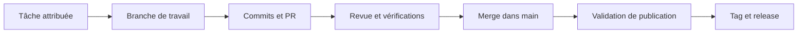

# Guide de collaboration et de versionnement

Ce guide fixe la façon de travailler à cinq sur **ft_transcendence** : organiser les tâches, modifier le code, relire les changements et publier des versions identifiables. Il s'adresse à tous les membres, quel que soit leur rôle ou leur expérience avec Git.

Les règles ci-dessous constituent notre convention d'équipe. Les réglages du dépôt et les automatisations décrits restent à mettre en place : ce document ne les active pas. Les exemples de plateforme utilisent GitHub ; une *pull request* y joue le même rôle qu'une *merge request* sur GitLab.

## Sommaire

1. [Repères essentiels](#1-repères-essentiels)
2. [Organisation à cinq](#2-organisation-à-cinq)
3. [Numéros de version](#3-numéros-de-version)
4. [Maturité et noms de version](#4-maturité-et-noms-de-version)
5. [Branches](#5-branches)
6. [Commits et contributions](#6-commits-et-contributions)
7. [Pull requests et merges](#7-pull-requests-et-merges)
8. [Synchronisation et conflits](#8-synchronisation-et-conflits)
9. [Publication des versions](#9-publication-des-versions)
10. [Correctifs urgents et annulations](#10-correctifs-urgents-et-annulations)
11. [Mise en place du dépôt](#11-mise-en-place-du-dépôt)

## 1. Repères essentiels

| Terme | Signification dans notre travail |
| --- | --- |
| **Issue / tâche** | Un travail décrit, attribué et assorti de critères de réussite. |
| **Branche** | Une ligne de travail isolée pour réaliser une tâche. |
| **Commit** | Un ensemble cohérent de modifications enregistré dans Git. |
| **Pull request (PR)** | Une demande de relecture et d'intégration d'une branche. |
| **Merge / fusion** | L'intégration du changement dans la branche cible. |
| **CI** | Les vérifications automatiques : compilation, tests, analyse du code, selon la stack. |
| **Tag** | Un repère nommé sur un commit précis, par exemple `v1.0.0`. |
| **Release / publication** | Une version validée, associée à un tag et à des notes de publication. |
| **Déploiement** | La mise en service d'une version dans un environnement. |



Au quotidien : **une tâche, une branche, une PR, une relecture indépendante**. Un merge rend le changement disponible dans `main`. La publication intervient lorsque l'équipe décide de livrer un ensemble validé ; elle n'est pas automatique après chaque merge.

## 2. Organisation à cinq

### Responsabilités

Les personnes qui portent les rôles sont identifiées dans « Team Information » du README. Tous les membres contribuent au projet et peuvent relire du code ; les rôles ajoutent des responsabilités.

| Rôle | Responsabilité dans ce workflow |
| --- | --- |
| **Product Owner (PO)** | Priorise les tâches, définit le périmètre des versions et valide le résultat fonctionnel. |
| **Project Manager (PM)** | Suit les tâches, les dépendances, les blocages et les créneaux de publication. |
| **Tech Lead** | Coordonne les choix techniques, le contrat de compatibilité et les revues des changements sensibles. |
| **Développeurs — tous les contributeurs** | Implémentent, vérifient, documentent et relisent les changements. |
| **Responsable de publication** | Pour une release donnée, rassemble les validations, choisit le commit et crée le tag. Cette responsabilité peut tourner. |

Une seule personne pilote une publication à la fois. Un second membre confirme avec elle la version, le commit et les résultats de validation. Cela évite deux publications concurrentes portant le même numéro.

### Décrire et répartir le travail

Utiliser un tableau commun : **À préciser → Prêt → En cours → En revue → Terminé**. Une tâche bloquée reste visible avec la cause et la personne attendue.

Avant de commencer, une tâche doit préciser :

- l'objectif et le comportement attendu, avec des critères vérifiables ;
- un responsable, un relecteur pressenti et les éventuels autres contributeurs ;
- les dépendances envers d'autres tâches et les composants concernés ;
- le jalon visé, par exemple la première version Vanilla ;
- le lien vers le module du sujet, lorsqu'il y en a un.

Une tâche est **terminée** lorsque sa PR est fusionnée et ses critères satisfaits. Le tag de release indiquera ensuite dans quelle version elle est livrée. Pour un travail découpé, une PR peut ne terminer qu'une sous-tâche.

### Coordination quotidienne

- Chacun signale son travail, ses blocages et ses besoins de revue les jours où il travaille.
- Le PM organise un point hebdomadaire pour ajuster les priorités et les dépendances.
- Le relecteur prend en charge une PR sous un jour ouvré, ou prévient pour qu'elle soit réattribuée.
- Avant de modifier une API commune, une migration de base de données, les dépendances ou la configuration, prévenir les personnes concernées dans l'issue ou la PR.
- Découper les travaux de plusieurs jours en étapes vérifiables séparément. Une fonctionnalité inachevée doit rester inaccessible aux utilisateurs si elle est intégrée progressivement.

## 3. Numéros de version

### Après la première version stable

Nous utilisons le format **`MAJEUR.MINEUR.CORRECTIF`**, issu de [SemVer](https://semver.org/lang/fr/).

| Changement livré | Partie augmentée | Exemple |
| --- | --- | --- |
| Rupture de compatibilité | MAJEUR | `1.4.2` → `2.0.0` |
| Fonctionnalité ajoutée en conservant la compatibilité | MINEUR | `1.4.2` → `1.5.0` |
| Interface publique déclarée obsolète, encore utilisable | MINEUR | `1.4.2` → `1.5.0` |
| Correction compatible | CORRECTIF | `1.4.2` → `1.4.3` |

Les parties à droite de celle qui augmente reviennent à zéro. Le numéro change au moment d'une publication ; chaque commit ou PR n'a pas besoin de son propre numéro. Pour une publication regroupant plusieurs changements, retenir l'impact le plus élevé depuis la dernière release de la série concernée.

### Ce que nous promettons de garder compatible

Avant `1.0.0`, le Tech Lead fait documenter les interfaces que l'équipe s'engage à maintenir : routes et réponses de l'API, messages temps réel, formats de données échangés et procédures d'installation/configuration prises en charge.

Exemples de décisions pour notre application :

- Ajouter une route sans modifier les routes existantes : évolution mineure.
- Supprimer un champ de réponse utilisé par un client existant : évolution majeure.
- Corriger un calcul erroné en conservant le format de réponse : correctif.
- Réorganiser le code interne sans changer le comportement : aucun changement majeur pour cette seule raison.
- Ajouter une table avec une migration compatible : aucun changement majeur pour cette seule raison.

Une dépréciation est annoncée avant une suppression prévue, avec le remplacement et la version visée. Toute PR qui rompt le contrat indique la rupture et la procédure de migration.

### Pendant le développement initial : `0.x.y`

Le zéro initial indique que le contrat n'est pas encore stable, même sans suffixe alpha ou beta. Pour notre équipe, la progression est fixée ainsi :

| Étape ou changement publié | Règle choisie |
| --- | --- |
| Initialisation du projet | `0.0.1`, état « pré-alpha ». |
| Nouvelle étape fonctionnelle ou changement incompatible | Augmenter le deuxième nombre : `0.1.0` → `0.2.0`. |
| Correction d'une étape existante | Augmenter le troisième nombre : `0.2.0` → `0.2.1`. |
| Première livraison stable | `1.0.0`, lorsque le socle obligatoire est complet, vérifié, documenté et que le contrat de compatibilité est défini. |

On peut conserver `0.0.1` pendant les premiers travaux. Sans tag publié, le numéro affiché dans un document indique une intention de version, pas une release existante.

Une modification purement documentaire attend généralement la prochaine publication. Si elle justifie une nouvelle distribution à elle seule, l'équipe peut publier un correctif. Le type d'un commit aide à comprendre le changement ; aucun outil ne doit déduire aveuglément la version à partir de ce type.

## 4. Maturité et noms de version

### Trois informations distinctes

| Information | Question à laquelle elle répond | Exemple |
| --- | --- | --- |
| **Numéro** | Quelle version et quel impact sur la compatibilité ? | `1.2.0` |
| **Maturité** | À quel stade de validation se trouve cette version ? | `rc.1` |
| **Nom** | Quel périmètre du projet est livré ou visé ? | `Ice Cream` |

### Maturité

Les critères suivants sont ceux de notre équipe. Le suffixe technique utilise les formes de préversion prévues par [SemVer](https://semver.org/lang/fr/).

| État | Critère | Exemple d'affichage |
| --- | --- | --- |
| **Pré-alpha** | Conception, initialisation ou premiers prototypes. | `0.0.1 — pré-alpha — cible Vanilla` |
| **Alpha** | Une partie des parcours fonctionne ; le périmètre visé reste incomplet. | `0.1.0-alpha.1 — cible Vanilla` |
| **Beta** | Le périmètre visé est implémenté ; les essais d'ensemble et corrections continuent. | `1.0.0-beta.1 — cible Vanilla` |
| **RC — Release Candidate** | Version candidate à la publication, en validation finale, sans problème bloquant connu. | `1.0.0-rc.1 — cible Vanilla` |
| **Stable** | À partir de `1.0.0`, les critères de publication sont satisfaits ; aucun suffixe de préversion. | `1.0.0 — Vanilla` |

Pour une même version cible, utiliser la progression `alpha.1`, `alpha.2`, puis `beta.1`, puis `rc.1`, `rc.2`, puis la version sans suffixe. Une correction pendant cette préparation augmente le compteur de candidate, par exemple `1.0.0-rc.1` → `1.0.0-rc.2`, en gardant la version cible. Si le périmètre change, réévaluer cette cible. « Pré-alpha » reste un état écrit dans la description, sans suffixe technique `-pre-alpha`.

### La progression gourmande

**Vanilla → Cream → Ice Cream → Sundae → Parfait**

L'idée est de partir de la vanille, produit de base, puis d'évoquer des préparations de plus en plus élaborées. Le nom décrit le contenu du projet ; il ne fixe aucun numéro.

| Nom | Critère d'attribution |
| --- | --- |
| **Vanilla** | Socle obligatoire complet et fonctionnel, sans bonus livré. |
| **Cream** | Socle Vanilla et ensemble initial de bonus défini pour ce jalon, entièrement livré. |
| **Ice Cream** | Périmètre Cream et au moins un module bonus mineur supplémentaire livré, sans module majeur supplémentaire au-delà de Cream. |
| **Sundae** | Périmètre Cream et au moins un module bonus majeur supplémentaire livré, avec ou sans ajouts mineurs supplémentaires. |
| **Parfait** | Distinction collective d'une version particulièrement aboutie, avec justification dans les notes de publication. |

Le socle obligatoire inclut les **14 points de modules requis**. Les modules supplémentaires peuvent compter comme bonus ; le sujet attribue 1 point à un mineur et 2 à un majeur, avec un maximum de 5 points de bonus pour l'évaluation. Voir les chapitres IV et VII du [sujet](en.subject.pdf). Ces critères d'évaluation restent distincts de nos noms de version.

Le PO consigne dans le README les modules retenus pour Vanilla et la liste initiale, non vide, des bonus de Cream. **La liste Cream est figée lors de sa première publication stable** : les ajouts ultérieurs sont comparés à cette référence. Un module majeur déjà inclus dans Cream ne suffit donc pas à déclencher Sundae.

Règles d'utilisation :

- Pendant les travaux, les préversions ou tant que le jalon reste incomplet, écrire **« cible Vanilla »**, **« cible Cream »**, etc. Le nom sans « cible » est attribué au périmètre réellement validé et publié.
- Les étapes peuvent être sautées : Cream peut être suivie directement de Sundae.
- Ajouter un bonus mineur à Sundae conserve Sundae. Plusieurs modules mineurs ne deviennent pas automatiquement un module majeur.
- Une correction conserve normalement le nom. Si un module est retiré, réévaluer le nom selon le contenu effectivement livré et expliquer le retrait.
- Pour Parfait, les cinq membres confirment le caractère exceptionnel de la publication : périmètre terminé, vérifications réussies, documentation à jour et raisons concrètes qui la distinguent. Le nom ne remplace aucun contrôle de qualité.
- Les correctifs qui préservent le périmètre d'une Parfait peuvent conserver ce nom. Une nouvelle évolution fonctionnelle nécessite une nouvelle décision pour porter cette distinction.

Une livraison intermédiaire peut être stable tout en ne portant encore aucun nom gourmand attribué. Par exemple, si un seul des trois bonus prévus pour Cream est prêt, on peut publier `1.1.0 — cible Cream (périmètre partiel)`, après validation du contenu livré. « Cible Cream » indique le jalon restant ; la stabilité dépend des vérifications et du contrat de compatibilité. Cette possibilité permet de livrer progressivement sans annoncer un jalon inachevé comme terminé.

### Exemples de publications

Les versions suivantes illustrent une progression possible ; elles ne constituent pas notre historique réel.

| Version | Contenu ou changement |
| --- | --- |
| `1.0.0 — Vanilla` | Première version stable du socle obligatoire. |
| `1.0.1 — Vanilla` | Correction d'un bug du socle. |
| `1.1.0 — Cream` | Livraison du premier ensemble de bonus, compatible avec `1.0.x`. |
| `1.2.0 — Ice Cream` | Ajout compatible d'un module mineur au-delà de Cream. |
| `1.3.0 — Sundae` | Ajout compatible d'un module majeur au-delà de Cream. |
| `2.0.0 — Sundae` | Changement incompatible de l'API, sans changement du niveau de bonus. |
| `2.1.0 — Parfait` | Ajouts compatibles et version distinguée collectivement pour son aboutissement. |

**Un module majeur du sujet peut donc donner une version mineure du logiciel.** Inversement, une rupture de compatibilité peut faire passer à `2.0.0` sans ajouter de bonus.

## 5. Branches

### Modèle retenu

Nous utilisons **`main` comme branche commune d'intégration**, avec des branches de travail courtes. Ce fonctionnement s'appuie sur le [GitHub flow](https://docs.github.com/en/get-started/using-github/github-flow).

`main` doit rester compilable et vérifiable selon les capacités déjà implémentées. En phase initiale, cela ne signifie pas que toute la mandatory est terminée. Les versions publiées sont repérées par leurs tags ; `main` peut contenir des changements plus récents que la dernière release.

Il n'y a pas de branche permanente `develop`, `frontend`, `backend` ou au nom d'un membre. Deux personnes peuvent travailler ensemble sur une branche de tâche, avec un responsable identifié.

### Quand créer une branche ?

Créer une branche **avant toute modification destinée à être partagée**, après attribution de la tâche. Cela concerne aussi les corrections, la documentation et la configuration. Partir de `main` à jour, sauf pour le cas de maintenance décrit plus loin.

| Préfixe | Usage | Exemple |
| --- | --- | --- |
| `feat/` | Nouvelle fonctionnalité | `feat/42-user-profile` |
| `fix/` | Correction courante | `fix/57-login-error` |
| `docs/` | Documentation | `docs/12-installation-guide` |
| `refactor/` | Réorganisation interne | `refactor/63-session-service` |
| `test/` | Travail sur les tests | `test/71-profile-validation` |
| `chore/` | Outillage, dépendances, préparation d'une release | `chore/release-1.2.0` |
| `hotfix/` | Correction urgente d'une version publiée | `hotfix/84-session-expiry` |
| `revert/` | Annulation d'un changement intégré | `revert/85-profile-regression` |
| `maintenance/` | Branche exceptionnelle pour corriger une série publiée | `maintenance/1.2` |

Format habituel : **`type/numero-issue-description-courte`**, en minuscules, sans espaces ni accents. Pour une préparation de release ou une branche de maintenance, le numéro de version sert d'identifiant.

Une branche correspond à un changement cohérent, idéalement réalisable en un à trois jours de travail. Si elle grossit, découper la tâche. Lorsque B dépend de A, intégrer d'abord une PR A exploitable, puis créer B depuis `main` ; documenter les exceptions avant de développer des branches dépendantes.

### Démarrer une tâche

Les commandes supposent un dépôt déjà initialisé, un distant nommé `origin` et un répertoire de travail propre. Les numéros et noms des exemples sont à remplacer par ceux de la tâche réelle.

```sh
git status
git switch main
git pull --ff-only origin main
git switch -c feat/42-user-profile
```

Si `git status` montre du travail non enregistré, le sauvegarder sur sa branche avant de changer de contexte. Si `pull --ff-only` échoue, examiner la divergence avec un autre membre ; ne pas forcer une remise à zéro pour continuer.

## 6. Commits et contributions

### Un commit compréhensible

Un commit décrit une modification cohérente. Éviter de mélanger une fonctionnalité, un grand reformatage et une mise à jour de dépendances sans lien.

Nous utilisons des messages en anglais, avec ce format interne :

```text
type(scope): description courte
```

Exemples :

```text
feat(profile): add avatar upload
fix(auth): reject expired sessions
docs(setup): explain environment configuration
refactor(api): extract request validation
```

Les types usuels sont `feat`, `fix`, `docs`, `refactor`, `test`, `chore`, `ci` (automatisation), `build` (construction du projet) et `revert` (annulation). Une branche `hotfix/` produit généralement un commit `fix`. Le `scope` désigne la zone concernée et peut être omis.

Pour une rupture, employer `!` et expliquer dans le corps ce qui change et comment migrer :

```text
feat(api)!: replace the legacy profile response

BREAKING CHANGE: clients must read displayName instead of nickname.
```

Avant le commit, examiner les fichiers ajoutés à l'index :

```sh
git add -p
git diff --cached
git commit -m "feat(profile): add avatar upload"
git push -u origin feat/42-user-profile
```

Pour un fichier nouveau que `git add -p` ne propose pas, utiliser `git add` avec son chemin explicite. Les fichiers `.env` contenant des secrets restent locaux ; les variables nécessaires sont documentées dans `.env.example` avec des valeurs factices.

### Préserver les contributions des cinq membres

Chaque membre utilise sa propre identité Git et porte des commits correspondant à son travail réel. Le sujet demande un historique qui montre les contributions de tous.

Vérifier l'identité locale au dépôt :

```sh
git config user.name
git config user.email
```

La fusion par squash regroupe une PR en un commit sur `main`. Vérifier l'auteur du commit final et conserver les co-auteurs lorsque le travail a été partagé. Un message peut inclure, après une ligne vide :

```text
Co-authored-by: Nom du contributeur <adresse-associee-a-son-compte>
```

Chaque membre doit être identifié comme auteur de commits correspondant à ses contributions réelles **dans l'historique de `main`**, pas seulement sur une branche temporaire. Les co-auteurs complètent cette trace. Les PR, tâches et rubriques « Individual Contributions » du README décrivent aussi qui a réalisé quoi. Voir la [documentation GitHub sur les co-auteurs](https://docs.github.com/en/pull-requests/how-tos/commit-changes/creating-a-commit-with-multiple-authors).

## 7. Pull requests et merges

### Ouvrir la PR tôt

Après le premier push utile, ouvrir une PR en **brouillon** vers `main` pour rendre le travail visible, ou vers `maintenance/X.Y` pour un correctif de maintenance. Vérifier la cible avant de demander la revue. Passer la PR en état « prête à relire » lorsque l'auteur a terminé sa propre vérification. Une PR en brouillon n'est pas fusionnée.

Le titre suit le format des commits. Sa description contient :

| Élément | Contenu attendu |
| --- | --- |
| Tâche liée | Numéro de l'issue ; `Closes #42` seulement si cette PR la termine. |
| Changement | Problème traité et comportement obtenu, avec exemple si utile. |
| Validation | Commandes réellement exécutées et résultats ; scénario manuel si nécessaire. |
| Impact de version | Aucun, correctif, mineur ou majeur, avec justification. |
| Installation et données | Variables, dépendances et migrations ajoutées ou modifiées. |
| Interface utilisateur | Capture ou description du résultat si cela aide la revue. |
| Limites | Travail restant, dépendances et points nécessitant une attention particulière. |

Si les outils de test n'existent pas encore, décrire les vérifications manuelles effectuées. Dès qu'une CI est disponible, ses contrôles applicables deviennent une condition de merge.

### Qui relit ?

- **Changement courant : une approbation indépendante**, par un membre qui n'a pas écrit le changement.
- **Changement sensible : deux approbations indépendantes**, dont le Tech Lead ou un relecteur technique désigné s'il est auteur. Sont concernés les ruptures de compatibilité, l'authentification, les permissions et les migrations pouvant altérer des données.
- La validation fonctionnelle du PO est nécessaire lorsqu'une PR modifie le périmètre ou les critères convenus. Elle ne remplace pas la revue technique.

Le relecteur vérifie le comportement, la compréhension du code, les cas d'erreur et la validation fournie. Il distingue un problème bloquant d'une suggestion facultative. Un changement du code après approbation demande une nouvelle validation du résultat final.

### Quand fusionner ?

La PR peut être fusionnée lorsque tous les points suivants sont satisfaits :

- [ ] Le périmètre annoncé et les critères de la tâche sont remplis.
- [ ] Les approbations nécessaires portent sur la dernière révision.
- [ ] Les retours bloquants sont traités et les discussions résolues.
- [ ] La branche intègre le dernier état de sa cible et ne présente aucun conflit.
- [ ] Les vérifications applicables passent sur le résultat à intégrer.
- [ ] La documentation, la configuration d'exemple et les migrations sont à jour si le changement les concerne.
- [ ] Les auteurs et co-auteurs du commit final sont corrects.

Nous utilisons **Squash and merge** pour les PR de tâche : un changement cohérent donne un commit sur `main`. L'auteur de la PR peut effectuer la fusion une fois les conditions remplies. Un autre membre peut s'en charger en coordination avec lui. Le fonctionnement du squash est décrit dans la [documentation GitHub sur les fusions](https://docs.github.com/en/pull-requests/reference/pull-request-merges).

Fusionner les PR une à une. Après le merge d'une autre PR, actualiser la suivante et relancer ses contrôles. Cela compte particulièrement pour deux changements qui touchent les mêmes interfaces.

### Après la fusion

Vérifier les contrôles de la branche cible. En cas d'échec après merge, suspendre les intégrations sans lien avec le problème et restaurer un état fonctionnel par une PR de correction ou de revert. Une fois le résultat validé, clôturer la tâche si elle est terminée, puis supprimer la branche distante via la plateforme. Pour une tâche intégrée dans `main`, mettre à jour sa copie locale :

```sh
git switch main
git pull --ff-only origin main
git fetch --prune origin
```

La prochaine tâche démarre sur une nouvelle branche. Après un squash, Git peut refuser la suppression locale avec `git branch -d`, car les commits d'origine ne figurent pas tels quels dans `main`. Vérifier que la PR est fusionnée et qu'aucun travail supplémentaire n'existe avant de supprimer cette copie locale ; en cas de doute, la garder et demander une revue.

## 8. Synchronisation et conflits

Actualiser sa branche avant la revue finale, avant le merge et après toute évolution de sa cible qui peut affecter le travail. Notre méthode habituelle consiste à intégrer **la cible réelle de la PR** dans la branche de tâche, sans réécrire les commits déjà partagés. Pour une tâche courante, cette cible est `main`.

Avec un répertoire de travail propre :

```sh
git switch feat/42-user-profile
git fetch origin
git merge origin/main
```

Pour un hotfix dont la PR cible `maintenance/1.2`, remplacer la dernière commande par `git merge origin/maintenance/1.2`, depuis la branche du hotfix. Ne pas y intégrer `origin/main`, qui pourrait contenir les évolutions à exclure de ce correctif.

Si la fusion réussit, exécuter les vérifications applicables et pousser la branche. Ce merge de synchronisation a lieu **sur la branche de tâche** ; l'intégration dans `main` passe toujours par la PR.

En cas de conflit :

1. Exécuter `git status` pour identifier les fichiers concernés.
2. Comprendre les deux modifications et contacter leur auteur si l'intention est incertaine.
3. Modifier les fichiers pour obtenir le comportement attendu et retirer les marqueurs de conflit.
4. Ajouter chaque fichier résolu avec `git add chemin/du/fichier`, puis exécuter `git merge --continue`.
5. Relancer les vérifications, examiner le résultat et exécuter `git push`.

Pour abandonner cette tentative de fusion, utiliser `git merge --abort`. Une résolution de conflit peut être syntaxiquement correcte tout en cassant le comportement ; elle doit donc être relue. Voir la [documentation de `git merge`](https://git-scm.com/docs/git-merge).

Le workflow courant n'utilise pas de force-push. Sur une branche partagée, ne pas réécrire les commits avec un rebase ou un amend. Si une opération exceptionnelle est nécessaire, la préparer avec les autres contributeurs avant de l'effectuer.

## 9. Publication des versions

### Format et référence de version

| Élément | Format |
| --- | --- |
| Tag stable | `v1.2.0` |
| Tag de préversion | `v1.2.0-rc.1` |
| Titre d'une release stable | `1.2.0 — Ice Cream` |
| Titre d'une candidate | `1.2.0-rc.1 — cible Ice Cream` |

Le tag publié fait référence pour identifier la version. Le nom gourmand figure dans le titre et les notes, sans être ajouté au tag. Le README peut refléter la version publiée ; un texte dans le README ne remplace pas le tag.

Si un manifeste ou l'application embarque un numéro de version, sa mise à jour fait partie de la préparation de publication. Les builds de développement doivent aussi exposer leur commit et leur état de développement pour les distinguer de la dernière release.

### Préparer la publication

1. **Choisir le périmètre.** Le PO et le responsable de publication recensent les PR livrées depuis le dernier tag pertinent, les tâches incluses et les limites restantes.
2. **Choisir le numéro, la maturité et le nom.** Appliquer les règles de ce guide au contenu réel, en tenant compte de toutes les ruptures et fonctionnalités ajoutées.
3. **Ouvrir une PR de préparation**, par exemple `chore/release-1.2.0`, depuis et vers `main`. Pour une publication de maintenance, créer cette branche depuis `maintenance/X.Y` et cibler cette même branche. Y regrouper les mises à jour nécessaires des versions embarquées, de la documentation et les notes de publication proposées. Si aucun fichier ne change, utiliser une issue de publication avec la même checklist.
4. **Annoncer un court créneau de validation.** Pendant ce créneau, différer les merges sans lien avec la publication ; les autres membres continuent sur leurs branches. Si la stabilisation s'allonge, replanifier la publication plutôt que bloquer durablement l'équipe.
5. **Fusionner la préparation puis choisir le commit exact.** Les vérifications finales portent sur ce commit après merge, car le squash produit un nouveau commit.
6. **Publier une candidate si utile.** Pour `1.0.0`, une version majeure ou une livraison comportant des migrations sensibles, passer par une RC. Les corrections suivantes donnent une nouvelle candidate et de nouvelles validations.
7. **Obtenir la confirmation du second membre**, puis créer et publier le tag stable. Publier les notes associées et lever le créneau de validation.

Une RC n'est pas promue en déplaçant son tag. Si le passage à stable ne change aucun fichier, le tag stable peut viser le même commit. Si un fichier passe de `1.2.0-rc.1` à `1.2.0`, ce changement passe par une PR et produit un nouveau commit à vérifier. Les artefacts finaux sont construits et vérifiés avec leur version finale.

### Checklist de publication

- [ ] Toutes les PR retenues sont fusionnées et le commit exact à publier est identifié.
- [ ] La CI applicable réussit sur ce commit et les parcours critiques fonctionnent.
- [ ] Une installation depuis un clone propre réussit avec les instructions du README.
- [ ] Pour une mise à jour, le passage depuis la version précédemment prise en charge a été vérifié, données comprises.
- [ ] Les variables, migrations et éventuelles actions de mise à jour sont documentées.
- [ ] Aucun problème bloquant connu n'empêche l'usage du périmètre annoncé ; les limites restantes sont écrites.
- [ ] Le numéro, le nom et les éventuelles versions embarquées sont cohérents.
- [ ] Les modules et contributions du README correspondent au contenu livré.
- [ ] Un second membre a confirmé le commit et la validation.

### Créer le tag sur le commit validé

Exemple pour une release `1.2.0 — Ice Cream`, après les validations précédentes. Remplacer `SHA_VALIDE` par le hash complet du commit contrôlé, et adapter le tag et le nom.

```sh
git fetch origin --tags
git show --no-patch --oneline SHA_VALIDE
git tag -a v1.2.0 SHA_VALIDE -m "Release 1.2.0 - Ice Cream"
git push origin v1.2.0
```

Publier uniquement le tag voulu. Un tag déjà partagé reste attaché à son commit ; en cas d'erreur, documenter le problème et publier une nouvelle version. Les [tags annotés de Git](https://git-scm.com/docs/git-tag) permettent d'associer un message et une identité à ce repère.

Créer ensuite la release sur la plateforme **à partir du tag existant**. Une alpha, beta ou RC est indiquée comme préversion. Les notes comportent :

- les fonctionnalités et corrections livrées, avec les PR ou issues correspondantes ;
- les ruptures éventuelles et la marche à suivre pour la mise à jour ;
- les limites connues et les validations réalisées ;
- le nom gourmand, son périmètre et, pour Parfait, la justification de la distinction ;
- les contributeurs.

Un déploiement utilise ce tag ou l'artefact produit depuis son commit. Une branche mouvante comme `main` ne permet pas à elle seule d'identifier ce qui a été déployé. Après déploiement, vérifier les parcours essentiels et noter la version réellement en service.

## 10. Correctifs urgents et annulations

### Corriger rapidement une version publiée

Un hotfix traite un défaut qui bloque l'usage, provoque une perte de données ou compromet la sécurité. Il conserve un périmètre limité au correctif. L'urgence accélère la prise en charge des revues ; les critères de validation restent applicables.

**Si `main` ne contient que des changements prêts à livrer avec ce correctif**, créer une branche `hotfix/` depuis `main`, ouvrir une PR et suivre la procédure habituelle. Le numéro de la publication tient compte de tout ce qui sera livré.

**Si `main` contient déjà des évolutions à exclure du correctif**, partir de la dernière version publiée de la série à réparer. Exemple : `v1.2.0` doit être corrigée alors que `main` prépare `1.3.0`.

1. Le responsable crée exceptionnellement `maintenance/1.2` depuis `v1.2.0` et applique les protections prévues pour les branches communes.
2. Le correctif est développé sur `hotfix/84-session-expiry`, créée depuis cette branche de maintenance.
3. La PR cible **`maintenance/1.2`** et reçoit les mêmes revues et vérifications que d'habitude.
4. Le responsable prépare et publie `v1.2.1` depuis le commit validé de maintenance, avec la procédure de release habituelle.
5. Une PR distincte reporte le correctif vers `main` si le problème y existe aussi. La tâche d'incident reste ouverte tant que ce report n'est pas fait ou explicitement déclaré inutile.

Exemple de création, uniquement si `maintenance/1.2` n'existe pas encore et que `v1.2.0` est bien le dernier tag de cette série :

```sh
git fetch origin --tags
git switch -c maintenance/1.2 v1.2.0
git push -u origin maintenance/1.2
git switch -c hotfix/84-session-expiry
```

Pour un correctif ultérieur, repartir de la branche de maintenance existante à jour. Ne pas recréer une branche depuis un ancien tag en perdant les corrections déjà livrées.

Le report vers `main` peut reprendre le commit du correctif avec `git cherry-pick -x SHA_DU_CORRECTIF` sur une nouvelle branche issue de `main`, puis une PR. Garder le correctif séparé des métadonnées de release pour ne pas recopier `1.2.1` dans une branche préparant `1.3.0`. Si le code a évolué, adapter la correction et la vérifier à nouveau. Voir la [documentation de `git cherry-pick`](https://git-scm.com/docs/git-cherry-pick).

Le support d'une ancienne série est exceptionnel et annoncé par le PO. La branche de maintenance est fermée lorsqu'elle n'est plus nécessaire ; les tags publiés restent conservés.

### Annuler un changement intégré

Une PR fusionnée par squash peut être annulée par un nouveau commit `revert`, dans une branche puis une PR :

```sh
git switch main
git pull --ff-only origin main
git switch -c revert/85-profile-regression
git revert SHA_DU_COMMIT_SQUASH
git push -u origin revert/85-profile-regression
```

Examiner les dépendances apparues depuis le changement avant de l'annuler. Le revert crée une nouvelle modification à vérifier ; il n'efface pas l'historique. Voir la [documentation de `git revert`](https://git-scm.com/docs/git-revert).

### Revenir à un déploiement précédent

Un **rollback de déploiement** remet en service un artefact précédemment validé. Il est distinct du revert dans Git. Avant ce retour, vérifier que l'ancienne application reste compatible avec les données et les migrations déjà appliquées ; restaurer une ancienne base peut faire perdre les écritures intervenues depuis.

Documenter l'incident, la version en service et la décision prise. Le correctif ultérieur reçoit un nouveau numéro. Aucun tag publié ni historique partagé n'est réécrit pour masquer la version défectueuse.

## 11. Mise en place du dépôt

Cette checklist est à réaliser au démarrage, puis à compléter lorsque l'outillage apparaît. Les commandes des sections précédentes supposent cette initialisation terminée.

- [ ] Attribuer les rôles et compléter « Team Information » dans le README.
- [ ] Donner aux cinq membres leur accès individuel au dépôt et vérifier leurs identités Git.
- [ ] Créer le tableau commun, les premières tâches et le jalon Vanilla ; définir le périmètre Cream avant de l'entamer.
- [ ] Si le dépôt est vide, faire relire le contenu initial par un second membre, puis créer et pousser le premier commit sur `main`. Ce bootstrap est l'exception nécessaire avant l'activation des protections.
- [ ] Protéger `main` et les futures branches `maintenance/*` : passage par PR, approbation indépendante et discussions résolues.
- [ ] Exiger une nouvelle approbation après modification et une branche à jour avant fusion ; les deux revues des changements sensibles sont contrôlées par l'équipe si la plateforme ne les impose pas automatiquement.
- [ ] Interdire les force-push et la suppression des branches communes ; limiter les contournements administrateur.
- [ ] Activer le squash pour les PR de tâche et la suppression des branches de tâche fusionnées.
- [ ] Ajouter les contrôles CI adaptés à la stack, puis les rendre obligatoires lorsqu'ils fonctionnent réellement.
- [ ] Définir qui peut publier des tags et restreindre, si la plateforme le permet, la modification et la suppression des tags `v*`.
- [ ] Ajouter `.gitignore`, `.env.example` et les instructions d'installation au fur et à mesure de la mise en place technique.

Les protections disponibles dépendent de la plateforme, de l'offre et de la visibilité du dépôt. Si une règle ne peut pas être automatisée, elle reste une règle de travail appliquée par les relecteurs. Les paramètres GitHub sont détaillés dans la [documentation des branches protégées](https://docs.github.com/en/repositories/configuring-branches-and-merges-in-your-repository/managing-protected-branches/about-protected-branches).

Toute évolution de ce guide passe ensuite par une PR de documentation, relue par un autre membre et signalée à toute l'équipe. Une convention doit rester connue des cinq participants pour être utile.
